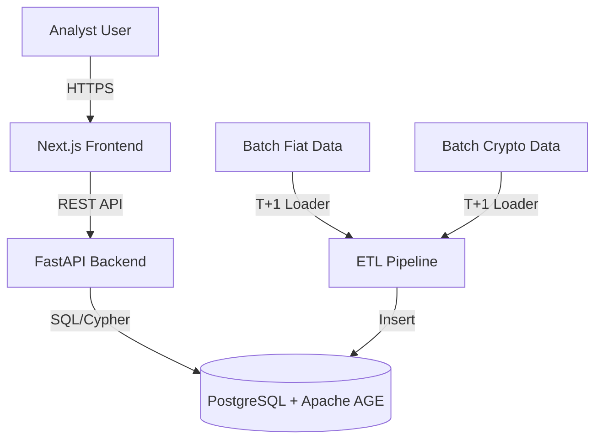

# Overwatch: AML Platform

## 1. Executive Summary

The Overwatch AML (Anti-Money Laundering) Platform is an advanced investigative suite designed for detecting, analyzing, and visualizing networked fund flows across traditional fiat methodologies (SWIFT) and Web3 (On-chain/Crypto) environments. By utilizing a hybrid relational-graph data architecture, the platform flags complex laundering typologies and offers a dynamic, node-based workspace for investigators.

## 2. Business Requirements

### Core Functional Requirements
- **Data Ingestion & Normalization**: T+1 batch processing for daily records, mapped into a unified property graph schema handling both fiat and crypto.
- **Regulatory Gate**: Pre-graph screening against OFAC, FATF, and internal blocklists.
- **Automated Analytics (Rule Engine)**: Daily batch execution of typologies such as Circular Flow, Smurfing, and Rapid Movement (Money Mules).
- **Investigation Workspace**: Unified dashboard for managing prioritized alerts, complete with a visual graph explorer for node neighborhood expansion and evidence export.

### Non-Functional Requirements
- **Security & Compliance**: Evidentiary audit logging, Role-Based Access Control (RBAC), and PII masking.
- **Performance**: Strict timeouts on graph queries, exclusion mechanisms for high-traffic "SuperNodes" (like omnibuses and major exchanges), and frontend responsiveness for smooth visual graph exploration.

## 3. System Design and Architecture

The platform follows a modular N-Tier architecture:

- **Frontend / Presentation Layer**: A Next.js (React) application for the investigation workspace, styled with Tailwind CSS and utilizing Cytoscape.js for graph visualization.
- **API & Business Logic Layer**: A Python 3.12+ / FastAPI backend handling complex queries, rules engine, and API functionality.
- **Data Persistency & Graph Layer**: PostgreSQL 16+ database enhanced with the Apache AGE openCypher extension, enabling both structured relational data storage and complex property graph traversals.
- **ETL & Data Ingestion Pipeline**: Dedicated scripts that unify fiat and crypto feeds into a unified schema efficiently.

### Component Diagram

### Operations & Deployment
- Deployment is currently orchestrated using Docker Compose (with Kubernetes as the intended target).
- Key operational features include automated SQL initializations, database connection pool monitoring, and a Dead Letter Queue (DLQ) for failed data ingestion triage.
