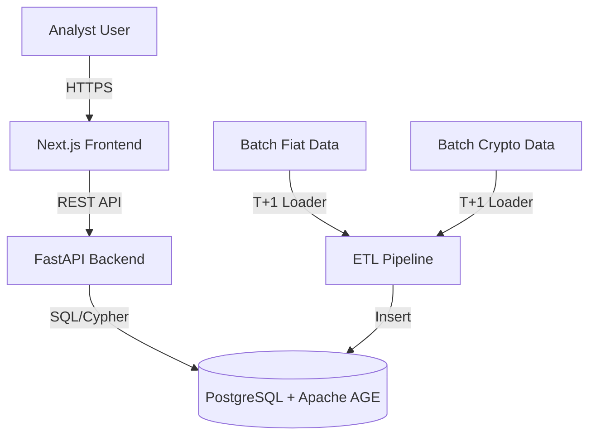

# Overwatch: AML Platform

## 1. Executive Summary

The Overwatch AML (Anti-Money Laundering) Platform is an advanced investigative suite designed for detecting, analyzing, and visualizing networked fund flows across traditional fiat methodologies (SWIFT) and Web3 (On-chain/Crypto) environments. By utilizing a hybrid relational-graph data architecture, the platform flags complex laundering typologies and offers a dynamic, node-based workspace for investigators.

## 2. Business Requirements

### Core Functional Requirements
- **Data Ingestion & Normalization**: T+1 batch processing for daily records, mapped into a unified property graph schema handling both fiat and crypto.
- **Regulatory Gate**: Pre-graph screening against OFAC, FATF, and internal blocklists.
- **Automated Analytics (Rule Engine)**: Daily batch execution of typologies such as Circular Flow, Smurfing, and Rapid Movement (Money Mules).
- **Investigation Workspace**: Unified dashboard for managing prioritized alerts, complete with a visual graph explorer for node neighborhood expansion and evidence export.

### Non-Functional Requirements
- **Security & Compliance**: Evidentiary audit logging, Role-Based Access Control (RBAC), and PII masking.
- **Performance**: Strict timeouts on graph queries, exclusion mechanisms for high-traffic "SuperNodes" (like omnibuses and major exchanges), and frontend responsiveness for smooth visual graph exploration.

## 3. System Design and Architecture

The platform follows a modular N-Tier architecture:

- **Frontend / Presentation Layer**: A Next.js (React) application for the investigation workspace, styled with Tailwind CSS and utilizing Cytoscape.js for graph visualization.
- **API & Business Logic Layer**: A Python 3.12+ / FastAPI backend handling complex queries, rules engine, and API functionality.
- **Data Persistency & Graph Layer**: PostgreSQL 16+ database enhanced with the Apache AGE openCypher extension, enabling both structured relational data storage and complex property graph traversals.
- **ETL & Data Ingestion Pipeline**: Dedicated scripts that unify fiat and crypto feeds into a unified schema efficiently.

### Component Diagram



### Operations & Deployment
- Deployment is currently orchestrated using Docker Compose (with Kubernetes as the intended target).
- Key operational features include automated SQL initializations, database connection pool monitoring, and a Dead Letter Queue (DLQ) for failed data ingestion triage.


## 4. AML Dashboard
A practical AML dashboard for Hong Kong should be built as a workflow dashboard, not just a monitoring screen: detect unusual fiat and stablecoin activity, route alerts through tiered review, escalate into cases, and produce JFIU-ready STR narratives with full audit trail and management oversight. HKMA expects transaction monitoring to cover alert generation, alert review with documented rationale, periodic tuning, KPI-based oversight, data-quality controls, and timely suspicious transaction reporting, while STRs should be accurate, complete, structured, and include relevant digital footprints where available.

## Dashboard modules

The core dashboard should have six linked modules: Monitoring, Alert Review, Case Management, STR Reporting, Screening, and Governance/MIS. HKMA’s guidance says transaction monitoring should generate alerts or MIS reports, support investigation of transaction background and purpose, document closure or escalation decisions, and provide sufficient audit trail for senior management oversight and periodic review.

For Hong Kong use, I would structure the dashboard like this:

- Real-time monitoring layer for fiat payments, deposits, withdrawals, card activity, remittances, virtual account flows, stablecoin mint/redeem events, wallet transfers, exchange in/out flows, and cross-channel customer behavior. HKMA says systems should be risk-based, institution-specific, and use complete and relevant data from source systems.
- Alert workbench for Level 1 and Level 2 review, with customer profile, prior alerts, linked accounts, counterparties, jurisdiction, device/IP data, and analyst rationale in one view. HKMA says alert handling should reference CDD profiles, prior alerts, open-source checks, customer enquiries where needed, and documented reasons for closure or escalation.
- Case management module that groups related alerts, customers, wallets, merchants, devices, and accounts into one investigation with timeline, notes, attachments, decisions, approvals, and law-enforcement references. HKMA notes networked relationships and common attributes are important for investigations and later STR reporting.
- STR preparation module that pre-fills JFIU-required fields, produces editable transaction schedules, captures digital footprints, and supports supplementary STRs without losing chronology. HKMA says STRs should be structured, concise, complete, and include mandatory account information, suspicious indicators, source/destination of funds, connected parties, and digital footprints where relevant.
- Screening module for sanctions, terrorist financing, proliferation financing, watchlists, and wallet/address blacklists, with separate queueing from behavioral monitoring but common case escalation. HKMA requires effective screening systems, timely database updates, tuning, documented match handling, and KPI-based oversight.
- Governance/MIS module for tuning reports, false-positive analysis, backlog control, trigger-event reviews, and AML committee reporting. HKMA’s 2024 thematic review highlights annual tuning reports, KPI-driven optimization, and AML committee approval of proposed changes.


## Workflow design

A strong workflow should move from trigger to review to case to STR with explicit SLAs and approvals. HKMA expects clear internal timelines, triage procedures, escalation for overdue alerts, and senior management attention where significant backlogs arise.

A recommended workflow is:

- Trigger: rules, scenarios, typology models, sanctions hits, wallet-risk events, velocity anomalies, structuring, layering, round-tripping, mule indicators, unusual redemption patterns.
- Review: L1 analyst validates data, checks profile and prior history, and either closes with rationale or escalates.
- Investigation: L2 or FIU investigator opens a case, links related customers/accounts/wallets, performs source-of-funds and network review, and records findings.
- Decision: disposition as no-suspicion, continue monitoring, enhanced due diligence, account restriction, exit, or STR.
- Reporting: STR drafted, QA-reviewed, approved, submitted to JFIU/STREAMS or relevant channel, with supplementary filings tracked.
- Post-reporting: monitor post-STR activity, freeze/escalate where legally required, and flag connected entities for enhanced monitoring. HKMA states post-alert and reporting controls need documentation, audit trail, and timely escalation.


## Alert triggers

Your alert library should separate fiat typologies, stablecoin typologies, and hybrid typologies, but score them in one risk engine. HKMA expects scenarios and thresholds to reflect the institution’s products, services, customer segments, and emerging typologies, with testing and periodic review.

Suggested fiat triggers:

- Sudden cash deposits or withdrawals inconsistent with profile.
- Structuring/smurfing below threshold bands over short periods.
- Rapid in-and-out movement with low economic purpose.
- Dormant-to-active account spikes.
- Funnel accounts receiving many third-party credits then quick outbound transfer.
- Cross-border flows to higher-risk jurisdictions or unusual correspondent corridors.
- Merchant/payment activity inconsistent with stated business.
- Temporary repository behavior and suspected mule patterns. HKMA specifically references substantial cash deposits, temporary repository of funds, and suspicious transaction patterns as relevant indicators.

Suggested stablecoin triggers:

- Rapid fiat-to-stablecoin conversion followed by external wallet transfer.
- Stablecoin receipt from or transfer to higher-risk wallet clusters, mixers, sanctioned or illicit-linked addresses.
- Peeling chains, layering through multiple wallets, or circular flows back to same beneficial owner.
- Large subscription/redemption patterns inconsistent with customer profile.
- Repeated use of newly created wallets with common device/IP or beneficiary patterns.
- Stablecoin transfers linked to fraud proceeds, OTC settlement networks, or mule-wallet behavior.
- Off-ramp to fiat shortly after complex on-chain hops.
- Recurrent P2P transfers designed to avoid expected onboarding or monitoring controls. HKMA’s broader transaction-monitoring expectations require integration of relevant external data and typologies, and the STR guidance emphasizes inclusion of digital footprints and connected relationships where relevant.

Suggested hybrid triggers:

- Customer receives suspicious fiat inflows, buys stablecoins, then disperses to multiple wallets.
- Stablecoin redemptions fund cash withdrawals or third-party outward transfers.
- Same customer/device/address linked to bank account network and wallet cluster.
- Repeated bank transfers to VASP or issuer counterparties followed by unusual account dormancy/reactivation. These align with HKMA’s expectation that systems monitor changing risk patterns and support enhanced targeting through integrated data sources.


## Review screen

The reviewer screen should answer one question fast: “Can I explain this activity with evidence?” HKMA says an alert should only be cleared when the institution is satisfied the abnormality can be explained, and the rationale must be documented alert by alert rather than via generic pre-set responses.

Each alert review page should include:

- Customer profile: risk rating, occupation/business nature, expected activity, source of wealth/funds, onboarding date.
- Activity snapshot: value, volume, channel, product, jurisdiction, counterparties, wallet addresses, token, chain, mint/redeem status.
- Behavioral context: prior 90/180/365 day pattern, peer group segment, previous alerts, prior STRs, linked subjects.
- Digital footprint: IP, device ID, login time, geolocation, channel used, beneficiary templates.
- Open-source and internal intelligence results.
- Decision panel: close, escalate, request info, EDD, account action, STR consideration.
- Mandatory narrative box: facts, analysis, rationale, next step. HKMA specifically calls for review against CDD profiles, prior alerts, open-source checks, customer enquiries where needed, and detailed audit trail.


## Case management

Case management should be entity-centric rather than alert-centric so investigators can see the entire network. HKMA’s STR guidance stresses reporting related accounts, common attributes, counterparties, and network relationships in the same STR where reasonably practicable.

Recommended case objects:


| Object | What to store |
| :-- | :-- |
| Subject | Customer, beneficial owner, wallet owner, related party, risk rating, CDD status  |
| Accounts/Wallets | Bank accounts, cards, wallet addresses, exchange IDs, chain and token details |
| Events | Alerts, analyst actions, escalations, freezes, customer contacts, STR filings  |
| Evidence | Transaction schedules, screenshots, open-source results, blockchain tracing, device/IP logs |
| Decisions | Closure reason, suspicion basis, approval chain, account treatment, follow-up actions |

Useful case functions are network graphing, timeline reconstruction, reusable typology tags, duplicate suppression, related-case linking, legal hold, and maker-checker approval. HKMA’s guidance repeatedly emphasizes independent review, oversight, and strong documentation of decisions and justifications.

## STR reporting

Your STR module should produce a narrative in the structure JFIU expects, not just export raw transactions. HKMA says every STR should be accurate, complete, and structured systematically, focusing on the main subject while covering triggering factors, subject background, business relationship, transactions, CDD/open-source findings, and conclusion/way forward.

A good STR template should force these sections:

- Triggering factors: typology, alert source, intelligence source, adverse news, law-enforcement reference if any.
- Subject profile: individual/corporate data, connected parties, account numbers, expected activity.
- Suspicious activity summary: review period, transaction flow, total in/out, counterparties, remarks, pattern explanation.
- Digital footprints: IP, timestamps, geolocation, device ID for online or cyber-enabled activity.
- Analysis: why activity is suspicious, including source-of-funds or source-of-wealth gaps.
- Network section: linked accounts, wallets, devices, common beneficiaries.
- Action taken: enhanced monitoring, account restriction, closure, supplementary STR to follow. HKMA also says attachments should supplement, not replace, the narrative, and transaction records should be editable.


## KPI set

The KPI pack should show effectiveness, efficiency, timeliness, quality, and governance. HKMA’s 2024 review states tuning reports can be driven by KPIs such as active customers, alert volumes, productive cases, and STR conversion rate, while the 2023 guidance requires defined objectives and KPIs for monitoring system effectiveness and efficiency.

Recommended KPI groups:

### Detection KPIs

- Alerts per 1,000 active customers/accounts/wallets. HKMA cites active customers and alert numbers as core tuning inputs.
- Alerts by product/channel: deposits, payments, remittance, trade, stablecoin mint, stablecoin redeem, on-chain transfer, off-ramp. This supports risk-coverage assessment by business line and product.
- Coverage ratio by scenario/typology, including fiat, stablecoin, and hybrid scenarios. HKMA expects institutions to assess risk coverage and whether new products require new scenarios.
- High-risk customer alert rate vs low-risk customer alert rate. HKMA expects segmentation and risk-based thresholds.

### Quality KPIs

- Productive alert rate, meaning alerts escalated for deeper investigation. HKMA mentions productive cases as a KPI basis.
- False-positive rate by scenario and by customer segment. HKMA explicitly references false-positive rates in KPI monitoring.
- False-negative review indicator from QA, lookback reviews, or law-enforcement feedback. HKMA expects periodic review of outputs and outcomes, not just alert counts.
- STR conversion rate from alerts and from cases. HKMA explicitly names STR conversion rate and STR rates.
- Repeat-alert rate after prior closure, useful for weak scenario tuning or poor analyst decisions. This supports enhancement of thresholds and alert handling.


### Timeliness KPIs

- Mean and percentile time from alert creation to first review.
- Mean and percentile time from alert escalation to case opening.
- Mean time from case opening to disposition.
- Mean time from suspicion formation to STR submission.
- Backlog aging: alerts over SLA, cases over SLA, STR drafts pending approval. HKMA requires internal timelines, backlog management, and prompt escalation of significant overdue items.


### STR quality KPIs

- % STRs with all mandatory fields completed.
- % STRs including source/destination of funds.
- % cyber-enabled STRs including digital footprints.
- % STRs submitted with editable transaction files.
- Supplementary STR rate and average days to supplementary filing.
- JFIU feedback issue rate or resubmission/rework rate, if you track external feedback. HKMA stresses accuracy, completeness, structured narratives, and digital footprints where relevant.


### Governance KPIs

- Annual/quarterly tuning completion rate.
- Scenario review coverage rate.
- Trigger-event review completion after product launch, alert surge, or new typology. HKMA notes ad hoc review should follow trigger events such as alert surges, product changes, or emerging typologies.
- Data quality exception count for critical data elements.
- Data lineage reconciliation success rate.
- Model validation completion for scoring or ML components.
- QA failure rate in alert clearance and screening clearance. HKMA expects regular data quality and lineage testing, functional testing, and assurance review of alert handling.


## Hong Kong-specific controls

For Hong Kong, your dashboard should be mapped directly to HKMA and JFIU expectations rather than generic global AML workflows. HKMA requires risk-based transaction monitoring, customer segmentation, threshold tuning, senior management oversight, periodic review, exception escalation, and strong documentation, while JFIU-focused STR guidance emphasizes concise but complete narratives and use of STREAMS/e-reporting mechanisms.

Minimum Hong Kong control points to surface in the dashboard:

- HKMA risk-based segmentation by customer type, business nature, product, geography, and risk rating.
- Audit trail for every alert closure, escalation, threshold change, and case decision.
- AML committee pack with KPI trend, scenario performance, backlogs, data quality issues, and planned tuning.
- Trigger-event review log for new products, especially stablecoin-related services or new payment rails.
- STR quality checklist aligned to JFIU expectations on structure, subject background, transaction facts, digital footprints, and related entities.
- Screening and monitoring integration so sanctions hits, fraud/mule signals, and behavioral anomalies can converge into one case. HKMA treats screening and transaction monitoring as distinct but related control systems under common governance.


## Stablecoin support

To support both fiat and stablecoins in Hong Kong, use one customer-risk model with two transaction lenses: account-based and wallet-based. HKMA’s transaction monitoring guidance emphasizes full risk coverage, integration of relevant data, and adjustment for new products and services, which fits a combined fiat-on-chain model better than separate systems.

For stablecoin-specific data, ingest:

- Wallet address and cluster ID.
- Blockchain, token, smart-contract version.
- Mint, burn, issue, redeem, transfer, bridge, swap, off-ramp events.
- Travel Rule/VASP metadata where available.
- Wallet sanctions/adverse exposure score.
- Device, IP, and login data linking customer to wallet actions.
- Links between named customer, omnibus account, custodian, and beneficial owner. HKMA also encourages integration of external data and digital footprints where relevant to suspicious activity analysis.


## Suggested executive dashboard

The home page should be simple and supervisory:

- Open alerts, open cases, pending STRs, overdue items.
- Productive alert rate, false-positive rate, STR conversion rate.
- Alert split by fiat, stablecoin, hybrid.
- Top typologies this month.
- High-risk corridors/jurisdictions and high-risk wallet clusters.
- Data-quality exceptions in critical data elements.
- Trigger-event review status for new products and recent tuning changes. This aligns closely with HKMA’s focus on alert volumes, productive cases, STR rates, data quality, and periodic optimization.

# One-page target operating model with AML Dashboard
Use as a design brief for an AML operations dashboard in Hong Kong covering fiat and stablecoin monitoring, alert handling, case management, and STR reporting. It is aligned to HKMA’s transaction monitoring and STR guidance and JFIU’s STREAMS 2 reporting expectations.[^1][^2]

## Operating model

The target operating model should run as a single end-to-end workflow: detect suspicious activity, review alerts against customer context, escalate linked items into a case, and produce structured STRs with full audit trail and Hong Kong-specific reporting fields. HKMA expects monitoring systems to generate alerts or MIS reports, require documented review and rationale, support periodic tuning and governance, and produce timely, accurate STRs; JFIU requires STRs to be submitted electronically through STREAMS 2.[^2][^1]


| Layer | Purpose | Key owner | Core outputs |
| :-- | :-- | :-- | :-- |
| Detection | Monitor fiat, stablecoin, and hybrid typologies across accounts and wallets | AML monitoring team | Alerts, risk scores, scenario hits |
| Review | Investigate alert background, customer profile, source/destination, and explanation [^1][^2] | L1 / L2 investigators | Closed alert, escalated alert, RFI, EDD trigger |
| Case | Group related customers, accounts, wallets, devices, and counterparties into one investigation | FIU / investigations | Case file, network view, disposition |
| Reporting | Draft and submit STR with structured narrative and digital footprint fields [^1][^2] | MLRO / authorized approver | STREAMS 2 STR, supplementary STR [^1][^2] |
| Governance | Tune thresholds, manage backlogs, QA reviews, and committee reporting | AML governance / committee | KPI pack, tuning proposals, QA findings |

## Dashboard wireframe

The dashboard should be one screen with role-based sections: executive oversight on top, operational queues in the middle, and drill-through investigation panels below. HKMA expects management oversight of system effectiveness, exception handling, backlog escalation, and KPI-based periodic review, so the wireframe should make those items visible without requiring separate reports.[^1]

```text
+--------------------------------------------------------------------------------------------------+
| AML Monitoring TOM – Hong Kong (Fiat + Stablecoin)                                               |
| Date | Entity | Business line | Segment | Theme toggle | Export MIS | Committee pack             |
+--------------------------------------------------------------------------------------------------+
| KPI STRIP                                                                                         |
| Open Alerts | Alerts > SLA | Open Cases | Pending STR | STR Conv % | False Pos % | Data Issues  |
+--------------------------------------------------------------------------------------------------+
| RISK & FLOW OVERVIEW                                                                              |
| Alerts by type: Fiat | Stablecoin | Hybrid        Top typologies        High-risk corridors      |
| Trend: 30d alerts / productive cases / STRs             Stablecoin mint-redeem / in-out trend    |
+--------------------------------------------------------------------------------------------------+
| ALERT WORKBENCH                                  | SCREENING & EXCEPTIONS                         |
| Queue by priority / age / scenario / analyst     | Sanctions/name hits                           |
| Selected alert:                                  | Wallet blacklist hits                          |
| - customer profile                               | Data lineage / failed ingestion               |
| - account + wallet activity                      | Model/rule test failures                       |
| - prior alerts / prior STR refs                  |                                                |
| - IP / device / geo / channel                    |                                                |
| Decision: Close | Escalate | RFI | EDD | Hold    |                                                |
+--------------------------------------------------------------------------------------------------+
| CASE DESK                                        | STR DRAFTING                                   |
| Related entities graph                           | Triggering factors                              |
| Timeline of transactions / notes / approvals     | Subject background                              |
| Linked accounts / wallets / devices              | Transactions & suspicious indicators            |
| Actions: freeze? exit? monitor?                  | Digital footprints / attachments / XML/PDF      |
+--------------------------------------------------------------------------------------------------+
| GOVERNANCE & TUNING                                                                              |
| Scenario effectiveness | Threshold review due | Backlog ageing | QA sample fail | Committee log  |
+--------------------------------------------------------------------------------------------------+
```

The operational drill-through should let users pivot from account to wallet to device to counterparty because HKMA expects alert review to use CDD profiles, prior alerts, open-source checks, and linked information, and its STR guidance says related networks and common attributes such as IP addresses and device IDs should be reported where reasonably practicable.[^1]

## KPI dictionary

The KPI set should balance effectiveness, efficiency, timeliness, data quality, and STR quality rather than focusing only on alert volume. HKMA says transaction monitoring systems should have defined objectives and KPIs, and its 2024 insight paper highlights tuning reports driven by active customers, alerts, productive cases, and STR conversion rate.[^2][^1]


| KPI | Formula | Suggested threshold | Why it matters |
| :-- | :-- | :-- | :-- |
| Alert rate | Total alerts / active customers or active monitored relationships x 1,000 [^2][^1] | Track by segment; investigate if variance > 20% month-on-month | Shows whether scenario coverage is proportionate to exposure |
| Productive alert rate | Alerts escalated to case / total reviewed alerts | Amber < 10%, red < 5% unless justified by low-risk portfolio [^2][^3] | Measures signal quality and scenario usefulness |
| False positive rate | Closed-as-non-suspicious alerts / total reviewed alerts [^1][^2] | Amber > 90%, red > 95% for mature scenarios [^3][^1] | HKMA expects efficiency and tuning to reduce unnecessary alerts |
| STR conversion rate | STRs filed / cases closed, or STRs filed / reviewed productive cases | Amber < 10%, red < 5% unless typology-specific rationale exists [^2][^3] | Explicitly cited by HKMA as a tuning KPI |
| First-review SLA | Alerts reviewed within SLA / total alerts | Green ≥ 95% within internal SLA | HKMA requires clear timelines and backlog management |
| Backlog ageing | Alerts over SLA / total open alerts | Amber > 10%, red > 20% | Significant overdue alerts should be escalated to management |
| Case cycle time | Avg days from case open to disposition | Target by typology, with 80th percentile tracked | Measures investigation efficiency and resource adequacy |
| STR timeliness | Avg days from suspicion formed to STR submission [^2][^1] | Green: as soon as practicable; internal target typically 1–3 business days after decision [^2][^1] | JFIU requires reporting as soon as practicable; HKMA expects prompt handling [^2][^1] |
| STR completeness | STRs with mandatory fields completed / total STRs [^1][^2] | Green ≥ 99% [^1][^2] | HKMA and JFIU both stress completeness of required information [^1][^2] |
| Digital footprint inclusion | Relevant cyber-enabled STRs with IP/device/time/geo included / total cyber-enabled STRs | Green ≥ 90% where data is available | HKMA expects digital footprints to be included where relevant and available |
| Editable transaction attachment rate | STRs with editable schedules / total STRs with transaction annexures | Green ≥ 95% | HKMA discourages non-editable transaction records |
| Data quality exception rate | Failed critical data checks / total critical records ingested | Amber > 1%, red > 3% | Accurate data and lineage are prerequisites for effective monitoring |
| Scenario review coverage | Scenarios reviewed in period / total active scenarios | Green 100% annually; higher-risk scenarios quarterly [^1][^2] | HKMA expects periodic review of parameters, thresholds, and outcomes |
| QA clearance defect rate | QA exceptions on alert closures / QA sample reviewed | Amber > 5%, red > 10% | HKMA expects independent assurance of alert clearance quality |
| Screening false positive rate | Screening non-hits / total screening alerts | Track by list and identifier type; tune if persistently excessive | HKMA requires balancing screening effectiveness and efficiency |

The thresholds above are a practical starting point rather than statutory limits, because HKMA does not prescribe universal numeric thresholds and instead expects institution-specific calibration based on risk profile, customer segmentation, and testing results. Any red or amber threshold should therefore be approved through the AML governance process and adjusted by business line, product type, and stablecoin risk typology.[^2][^1]

## Control-to-screen mapping

The control-to-screen mapping should prove that each Hong Kong regulatory expectation is visible in the user interface, not hidden in procedures. HKMA expects institutions to evidence oversight, documentation, data quality, threshold tuning, and STR quality, while JFIU expects structured STR information, reasons for suspicion, customer explanation if any, and electronic filing via STREAMS 2.[^1][^2]


| Regulatory expectation | Control objective | Screen / widget | Required fields / actions |
| :-- | :-- | :-- | :-- |
| HKMA TM system produces alerts or MIS reports | Detect suspicious or abnormal patterns across products and channels | Risk \& Flow Overview; Alert Workbench | Scenario ID, alert timestamp, channel, fiat/stablecoin flag, score |
| HKMA alert review must examine background, purpose, customer profile, and document rationale | Ensure every closure or escalation is evidence-based | Alert detail panel | CDD profile, prior alerts, customer explanation, open-source checks, closure rationale |
| HKMA requires segmentation, thresholds, and testing | Tune scenarios by risk segment and product | Governance \& Tuning | Segment, threshold set, last tuned date, test result, approver |
| HKMA requires data integrity, quality, and lineage testing | Prevent false alerts or missed alerts caused by bad data | Data Issues widget | Source system, failed field, exception volume, remediation owner |
| HKMA requires timelines, triage, backlog escalation | Maintain timely review and escalate overdue work | KPI strip; queue ageing panel | Age buckets, owner, escalation status, committee flag |
| HKMA requires independent QA of alert clearance | Validate consistency and quality of analyst decisions | Governance \& Tuning | QA sample, exception type, analyst, remediation action |
| HKMA screening systems need current databases, tuning, and alert handling | Manage sanctions/name/wallet-list monitoring effectively | Screening \& Exceptions | List source, update time, hit status, false-positive trend, escalation notes |
| HKMA STRs must be accurate, complete, structured, and concise | Improve intelligence value of filings | STR Drafting | Triggering factors, subject profile, transaction summary, conclusion, next steps |
| HKMA encourages digital footprints where relevant and available | Capture cyber-enabled evidence for online and wallet activity | STR Drafting; Case Desk | IP, device ID, timestamps, geolocation, login channel |
| HKMA says attachments should supplement narratives and transaction files should be editable | Make STRs more usable by JFIU | STR Drafting | Narrative text box, editable CSV/XLS attachment, document type labels |
| HKMA says connected networks and common attributes should be reported where practicable | Present linked accounts, wallets, devices, and counterparties in one case | Case Desk graph | Linked entities, common IP/device, prior STR refs, relationship type |
| JFIU SAFE approach: Screen, Ask, Find, Evaluate | Enforce disciplined suspicion assessment | Alert detail workflow | Suspicious indicator, customer question log, internal record review, investigator evaluation |
| JFIU says report when knowledge or suspicion exists as soon as practicable | Prevent delayed filing | KPI strip; STR queue | Suspicion date, filing due clock, approver SLA |
| JFIU STREAMS 2 electronic submission only for regulated entities | Ensure filing readiness and channel control | STR Drafting | XML/PDF/web-form output status, e-cert readiness, submission reference |
| JFIU requires personal/company particulars, suspicious activity details, reasons, and explanation if any | Ensure base reporting completeness | STR Drafting mandatory fields | Name, ID, DOB/incorporation, address, account number, suspicious facts, explanation |

## Fiat and stablecoin design rules

The same operating model should support both bank-led fiat activity and wallet-led stablecoin activity, but the data model should distinguish account events from on-chain events. HKMA’s guidance emphasizes that monitoring design must reflect the institution’s own risks, products, services, and emerging typologies, and it encourages use of external and supplementary data to improve targeting.[^1]

For that reason, every alert and case object should include a unified entity spine with customer, account, wallet, device, IP, counterparty, jurisdiction, chain, token, and source-of-funds/source-of-wealth fields. That design supports hybrid patterns such as fiat inflow to account, rapid conversion to stablecoin, onward transfer to multiple wallets, and later redemption or off-ramping, while still feeding a single STR narrative and a single governance pack.[^1]

## Decision rights

A clear approval model is part of the target operating model because HKMA repeatedly emphasizes governance, oversight, and documented justification for major decisions. The most practical setup is L1 analysts close or escalate low-complexity alerts, L2 investigators own cases and high-risk stablecoin patterns, the MLRO approves STR filing and supplementary STRs, and the AML committee approves material scenario changes, tuning outcomes, and remediation of significant backlog or data-quality issues.[^2][^1]


``` Powershell
docker-compose -f Z:\GITHUB\Overwatch\etl\docker-compose.etl.yml up -d
```

<span style="display:none"></span>

<div align="center"></div>
