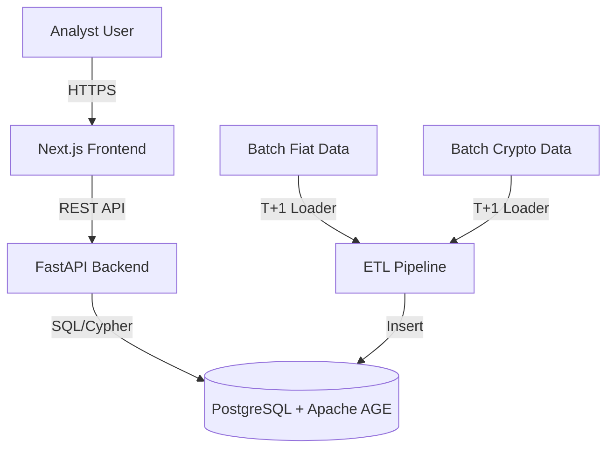

# AML Platform: System Design and Architecture Specification

## 1. Executive Summary
The AML (Anti-Money Laundering) Platform is an advanced investigative suite designed for detecting, analyzing, and visualizing networked fund flows across traditional fiat methodologies (SWIFT) and Web3 (On-chain/Crypto) environments. By utilizing a hybrid relational-graph data architecture, the platform flags complex laundering typologies and offers a dynamic, node-based workspace for investigators.

## 2. High-Level Architecture
The system employs a modular N-Tier architecture composed of the following core layers:

1. **Frontend / Presentation Layer**: A Next.js (React) application serving as the investigation workspace.
2. **API & Business Logic Layer**: A Python-based FastAPI backend that handles queries, rule execution, and RBAC enforcement.
3. **Data Persistency & Graph Layer**: An integrated PostgreSQL 16+ database enhanced with the Apache AGE openCypher extension, enabling both structured relational data storage and complex property graph traversals seamlessly.
4. **ETL & Data Ingestion Pipeline**: Python extraction scripts that unify fiat and crypto feeds into a unified schema securely.

### Component Diagram

## 3. Detailed Component Specification

### 3.1 Data Ingestion & Storage
The foundation relies on an integrated relational schema handling raw intakes alongside an `ag_catalog` graph for relational connections.

* **Relational Staging**: 
  * `staging_fiat_raw`: Holds batch ingested fiat transfers (SWIFT, banking).
  * `staging_crypto_raw`: Holds processed on-chain transactions across networks (e.g., ETHEREUM, BITCOIN).
* **Graph Schema (Apache AGE)**:
  * Entities (Wallets, Bank Accounts, Legal Entities) are mapped as graph **Nodes** using Vertex Labels (`Entity`, `SuperNode`).
  * Financial flows are mapped as graph **Edges** via the `Transfer` label.
* **Super-Node Exclusions**: Handles omnibuses and high-traffic exchanges (e.g., Binance Hot Wallets) distinctively by applying relational exclusion filters, preventing graph traversal blowouts.

### 3.2 AML Rule Engine & Automation
Detection typologies are run as daily batch scripts natively utilizing OpenCypher queries:
* **Circular Flow Detection**: Cypher patterns matching 2-to-5 hop cycle flows looping funds back to the point of origin.
* **Smurfing / Structuring**: Aggregate layering of sub-reporting-threshold transfers ($< $10k equivalent).
* **Money Mules / Rapid Movement**: Entities forwarding >90% of received funds within tight temporal windows.
* **Regulatory Gateway**: Strict relational pre-screening against current OFAC sanctions logic and FATF restrictions.

Findings are cascaded into an `alerts` queue for human investigator review.

### 3.3 Investigation Workspace (Frontend)
The interface is constructed via Next.js and optimized for rapid visual correlation:
* **Alerts Dashboard**: Filterable queue managing cases through statuses (OPEN, UNDER_REVIEW, ESCALATED, CLOSED, FALSE_POSITIVE).
* **Visual Graph Explorer**: Uses `cytoscape.js` alongside advanced layout algorithms allowing analysts to intuitively crawl node neighborhoods up to 5 hops deep. Provides rich metadata popups for individual edges and supports evidentiary export.

## 4. Security & Compliance 
* **Role-Based Access Control (RBAC)**: Distinct permissions for JUNIOR_ANALYST, SENIOR_INVESTIGATOR, DEPARTMENT_HEAD, and ADMIN models, implemented via FastAPI dependency injections and JWT authentication.
* **Audit Logging**: Every graph expansion, critical search, and alert transition is immutably logged for oversight/evidentiary pipelines.
* **Environment Sandboxing**: Built via `docker-compose` wrapping the application logic from the database lifecycle.

## 5. Automation & Operational Tooling
* **Dead Letter Queue (DLQ)**: Maintains unprocessed entries failing integrity or mapping constraints for downstream engineering triage, preventing data drops.
* **Deployment Validation**: Managed through continuous integration and isolated healthcheck-enabled Docker topologies (`docker-entrypoint-initdb.d`), ensuring reliable orchestration state.
