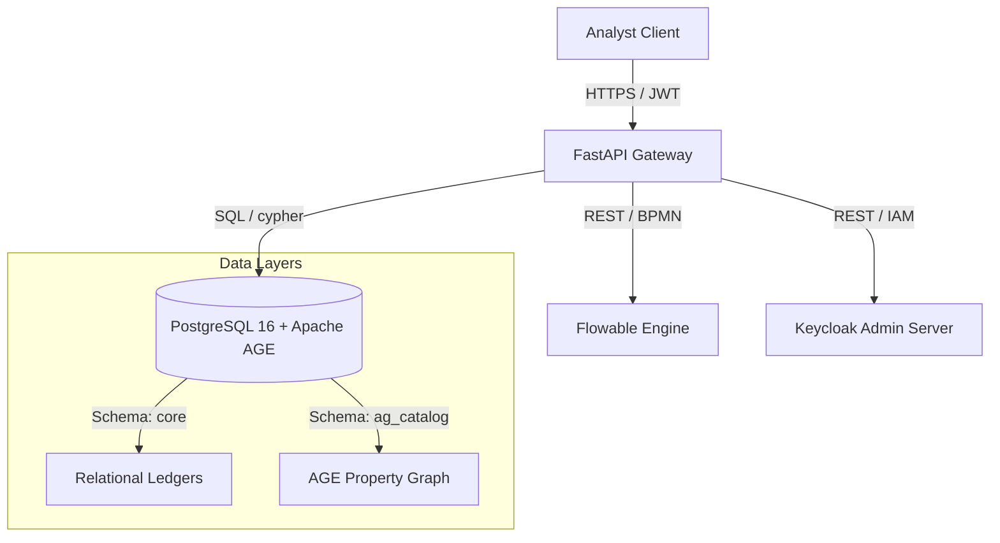
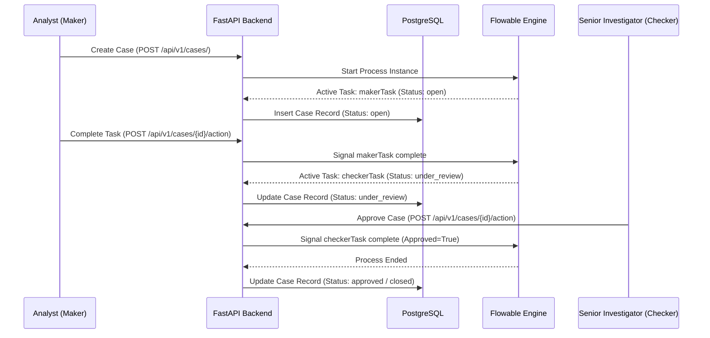

# Overwatch AML Platform API Reference

This document serves as the developer manual and complete API reference for the Overwatch Anti-Money Laundering (AML) Platform.

---

## 1. Architectural System Overview

The Overwatch AML Platform employs a hybrid data architecture combining highly structured relational tables with a flexible property graph database. This design enables high-throughput transactional logging alongside multi-hop relationship traversal for typology discovery.



### 1.1 Datastore & Graph Configuration
- **Relational Schemas**: 
  - `raw`: Staging and Dead Letter Queue (DLQ) tables for faulty batch files (e.g., `raw.wallet_ledger_dlq`).
  - `core`: Normalized database entities, including `core.customers`, `core.counterparties`, and `core.transactions`.
  - `app`: Application entities for auditing, RBAC mapping, alerts, and investigations.
- **Apache AGE Graph**:
  - Graph Instance: `tap_and_go_network`
  - Vertices: `Customer`, `Counterparty`, `Merchant`
  - Edges: `TRANSFERRED` (between Customers/Counterparties), `PAID` (Customer -> Merchant)

---

## 2. Authentication & Authorization

Authentication is handled via OAuth2 stateless JSON Web Tokens (JWT) signed with a symmetric secret key (`HS256`).

### 2.1 Role-Based Access Control (RBAC) & Scopes
The platform maps standard application roles to fine-grained security scopes. These scopes determine structural permission access inside endpoints:

| Role | OAuth2 Scopes Granted | Permissions / Access Level |
| :--- | :--- | :--- |
| `ANALYST` | `["alert.read"]` | View masked alert feeds, triage and assign alerts, view low-severity cases. |
| `SENIOR_INVESTIGATOR` | `["alert.read", "graph.explore"]` | Perform full graph query exploration, unmask transaction PII (triggers audit), approve closed cases (Checker). |
| `DEPARTMENT_HEAD` | `["alert.read", "graph.explore"]` | Complete access to analytics, audit history, and daily KPI datamarts. |
| `ADMIN` | `["alert.read", "graph.explore"]` | Full local system configuration and Keycloak user provisioning. |

---

## 3. Multi-Tenancy & Compliance Security

The Overwatch Platform implements strict data isolation and compliance tracking at the database layer.

### 3.1 Row-Level Security (RLS)
The `app.alerts` and `app.cases` tables have PostgreSQL Row-Level Security active. Multi-tenant isolation is enforced via the `tenant_isolation` policy, checking the dynamic session parameter:

```sql
ALTER TABLE app.alerts ENABLE ROW LEVEL SECURITY;
CREATE POLICY tenant_isolation_alerts ON app.alerts
    USING (tenant_id::text = current_setting('app.current_tenant', true));
```

Developers must ensure database connections configure `app.current_tenant` in the transaction context before running queries against RLS-protected tables.

### 3.2 Dynamic PII Masking & Unmasking Audits
To maintain compliance with privacy frameworks (e.g., HKMA guidelines on transaction monitoring), Personal Data is dynamically masked by the API before response dispatch based on the calling user's role.

- **Analyst Role**: Fields like `customer_num` and `counterparty_id` are returned with standard cryptographic masks.
- **Senior Investigator / Department Head Roles**: Accessing unmasked data triggers a mandatory entry in the regulatory audit log (`app.audit_access_events`) to track target resources.

---

## 4. Keycloak & Flowable Integrations

The Overwatch application layer orchestrates identity management and structured investigative processes by integrating with Keycloak and Flowable.

### 4.1 Keycloak User Provisioning Flow
1. Admin requests provisioning of a new local user via `POST /api/v1/admin/users`.
2. The FastAPI server communicates with the Keycloak Admin API to register credentials.
3. Upon registration, the Keycloak User ID (`UUID`) is returned and mapped to the local database inside `app.app_users` along with a tenant membership record in `app.tenant_memberships`.

### 4.2 Flowable BPMN Workflow Engine
Case investigations follow a strict **Maker-Checker** pattern executed on Flowable:



---

## 5. REST API Reference

All requests must set the header `Content-Type: application/json` unless otherwise noted. Authenticated endpoints require the header `Authorization: Bearer <JWT_TOKEN>`.

### 5.1 Authentication Router

#### `POST /api/v1/auth/login`
Authenticate user credentials and retrieve a stateful access token.

- **Auth Required**: None (Anonymous)
- **Request Format**: `application/x-www-form-urlencoded`
  - `username` (string, required): Username of the investigator.
  - `password` (string, required): Plaintext password.
- **Response (200 OK)**:
  ```json
  {
    "access_token": "eyJhbGciOiJIUzI1NiIsInR5cCI6IkpXVCJ9...",
    "token_type": "bearer"
  }
  ```
- **Error Codes**:
  - `401 Unauthorized`: Credentials mismatch or user is inactive.

##### Code Snippets
```bash
curl -X POST "http://localhost:8000/api/v1/auth/login" \
     -H "Content-Type: application/x-www-form-urlencoded" \
     -d "username=investigator_01&password=securepassword"
```
```python
import requests

url = "http://localhost:8000/api/v1/auth/login"
data = {"username": "investigator_01", "password": "securepassword"}
response = requests.post(url, data=data)
token = response.json()["access_token"]
```
```javascript
const response = await fetch("http://localhost:8000/api/v1/auth/login", {
  method: "POST",
  headers: { "Content-Type": "application/x-www-form-urlencoded" },
  body: new URLSearchParams({
    username: "investigator_01",
    password: "securepassword"
  })
});
const { access_token } = await response.json();
```

---

### 5.2 Admin Router

#### `POST /api/v1/admin/users`
Provision a user in Keycloak and synchronize their mapping inside local tenant databases.

- **Auth Required**: Yes (`ADMIN`)
- **Headers**:
  - `X-Tenant-Id` (string, required): Tenant context executing this addition.
- **Request Body**:
  ```json
  {
    "username": "investigator_new",
    "email": "new_user@overwatch.net",
    "first_name": "Jane",
    "last_name": "Doe",
    "password": "temporarypassword123"
  }
  ```
- **Response (201 Created)**:
  ```json
  {
    "status": "success",
    "message": "User provisioned and mapped locally.",
    "keycloak_user_id": "c138d6df-2035-4cb6-a664-966904bc0f4f",
    "local_user_id": "8f30bbdf-fb2d-45db-91cd-cc87c3a0df47"
  }
  ```
- **Error Codes**:
  - `400 Bad Request`: Provisioning or sync mapping failure.
  - `401 Unauthorized`: Missing or invalid token.
  - `422 Unprocessable Entity`: Validation validation error.

##### Code Snippets
```bash
curl -X POST "http://localhost:8000/api/v1/admin/users" \
     -H "Authorization: Bearer $TOKEN" \
     -H "X-Tenant-Id: 2c1ebdfc-a63e-4fb8-8e67-ea2179fc2c4b" \
     -H "Content-Type: application/json" \
     -d '{"username": "jdoe", "email": "jdoe@overwatch.net", "password": "Pass123!", "first_name": "John", "last_name": "Doe"}'
```

---

#### `GET /api/v1/admin/users`
Get all users mapped to the current tenant.

- **Auth Required**: Yes (`ADMIN`)
- **Headers**:
  - `X-Tenant-Id` (string, required): Target tenant filter.
- **Response (200 OK)**:
  ```json
  {
    "status": "success",
    "users": [
      {
        "user_id": "8f30bbdf-fb2d-45db-91cd-cc87c3a0df47",
        "username": "investigator_01",
        "email": "investigator_01@overwatch.net",
        "full_name": "Alice Smith",
        "status": "active",
        "joined_at": "2026-06-01T12:00:00Z"
      }
    ]
  }
  ```

---

#### `GET /api/v1/admin/roles`
Retrieve pre-configured database system roles mapped within tenant boundaries.

- **Auth Required**: Yes (`ADMIN`)
- **Response (200 OK)**:
  ```json
  {
    "status": "success",
    "roles": [
      {
        "role_id": "f5fbf759-4673-455b-b9d5-4554f67ff7bf",
        "role_code": "ANALYST",
        "role_name": "L1 Analyst",
        "description": "Standard transactional alert screening"
      }
    ]
  }
  ```

---

#### `POST /api/v1/admin/users/{local_user_id}/roles`
Map an internal tenant scope role directly to an active local user.

- **Auth Required**: Yes (`ADMIN`)
- **Headers**:
  - `X-Tenant-Id` (string, required): Execution tenant target.
- **Request Body**:
  ```json
  {
    "role_code": "SENIOR_INVESTIGATOR"
  }
  ```
- **Response (200 OK)**:
  ```json
  {
    "status": "success",
    "message": "Role 'SENIOR_INVESTIGATOR' assigned to user."
  }
  ```

---

### 5.3 Alerts Router

#### `GET /api/v1/alerts/feed`
Fetch real-time transaction ledgers, sorted chronologically descending.

- **Auth Required**: Yes (`ANALYST` or higher)
- **Query Parameters**:
  - `limit` (integer, optional, default: 150): Result set paging limit.
- **Response (200 OK)** (Data is dynamically masked for `ANALYST` role):
  ```json
  [
    {
      "txn_hash": "a4d8c6b7...",
      "customer_num": "CUST-***-XX",
      "counterparty_id": "PART-***-XX",
      "txn_date": "2026-06-02T08:00:00",
      "txn_ref_no": "TXN-88491",
      "txn_country": "HK",
      "txn_currency": "HKD",
      "txn_currency_amount": 500000.0,
      "txn_amount_in_hkd": 500000.0,
      "cdi_code": "01",
      "txn_type": "FPS_TRANSFER"
    }
  ]
  ```

---

#### `GET /api/v1/alerts/`
Retrieve transaction velocity and typology triggers needing review.

- **Auth Required**: Yes (`ANALYST` or higher)
- **Query Parameters**:
  - `status` (string, optional, default: `'OPEN'`): Filter status (`OPEN`, `TRIAGED`, `ESCALATED`, `CLOSED`).
  - `limit` (integer, optional, default: 100): Result sizing.

---

#### `GET /api/v1/alerts/{alert_id}`
Retrieve extensive transaction metadata for a specific triggered alert.

- **Auth Required**: Yes (`ANALYST` or higher)
- **PII Audit Mechanism**: If accessed by `SENIOR_INVESTIGATOR` or `DEPARTMENT_HEAD`, raw PII (unmasked fields) will be returned, automatically writing a tracking line to `app.audit_access_events`.
- **Response (200 OK)**:
  ```json
  {
    "txn_hash": "a4d8c6b7...",
    "customer_num": "CUST-883901",
    "counterparty_id": "PART-004812",
    "txn_date": "2026-06-02T08:00:00",
    "txn_currency_amount": 500000.0,
    "txn_amount_in_hkd": 500000.0,
    "txn_type": "FPS_TRANSFER"
  }
  ```

---

#### `POST /api/v1/alerts/{alert_id}/assign`
Assign an unmanaged alert to the active analyst.

- **Auth Required**: Yes (`ANALYST` or higher)
- **Response (200 OK)**:
  ```json
  {
    "status": "assigned",
    "alert_id": "a4d8c6b7..."
  }
  ```

---

#### `POST /api/v1/alerts/{alert_id}/propose-close`
Propose clearing an alert as false-positive or triaged.

- **Auth Required**: Yes (`ANALYST` or higher)
- **Query Parameters**:
  - `notes` (string, required): Rationale justification (Mandatory).
- **Response (200 OK)**:
  ```json
  {
    "status": "proposed_close",
    "notes": "Cleared: Normal peer activity pattern verified.",
    "alert_id": "a4d8c6b7..."
  }
  ```

---

#### `POST /api/v1/alerts/{alert_id}/approve`
Formally close a proposed alert (Checker stage).

- **Auth Required**: Yes (`SENIOR_INVESTIGATOR` or higher)
- **Response (200 OK)**:
  ```json
  {
    "status": "approved",
    "alert_id": "a4d8c6b7..."
  }
  ```

---

#### `POST /api/v1/alerts/{alert_id}/reject`
Reject proposed alert closure and return to queue.

- **Auth Required**: Yes (`SENIOR_INVESTIGATOR` or higher)
- **Query Parameters**:
  - `notes` (string, required): Rejection reason (Minimum 5 characters).
- **Response (200 OK)**:
  ```json
  {
    "status": "rejected",
    "notes": "Insufficient documentation on peer review",
    "alert_id": "a4d8c6b7..."
  }
  ```

---

### 5.4 Cases Router

#### `GET /api/v1/cases/`
Retrieve cases within the executing tenant context.

- **Auth Required**: Yes (`ANALYST` or higher)
- **Response (200 OK)**:
  ```json
  [
    {
      "case_id": "761ebdfc-a63e-4fb8-8e67-ea2179fc2c4b",
      "case_number": "CASE-99281",
      "status": "under_review",
      "severity": "high",
      "created_by": "8f30bbdf-fb2d-45db-91cd-cc87c3a0df47",
      "assigned_to": null,
      "reviewer_id": null,
      "approver_id": null,
      "created_at": "2026-06-01T15:30:00Z",
      "workflow_instance_id": "10029"
    }
  ]
  ```

---

#### `POST /api/v1/cases/`
Escalate an alert to an active case, instantiating a new Flowable process.

- **Auth Required**: Yes (`ANALYST` or higher)
- **Request Body**:
  ```json
  {
    "alert_id": "a4d8c6b7-a63e-4fb8-8e67-ea2179fc2c4b"
  }
  ```
- **Response (200 OK)**:
  ```json
  {
    "status": "success",
    "case_id": "761ebdfc-a63e-4fb8-8e67-ea2179fc2c4b",
    "workflow_instance_id": "10029"
  }
  ```

---

#### `GET /api/v1/cases/{case_id}`
Retrieve a case detail along with active Flowable BPMN state.

- **Auth Required**: Yes (`ANALYST` or higher)
- **Response (200 OK)**:
  ```json
  {
    "case_id": "761ebdfc-a63e-4fb8-8e67-ea2179fc2c4b",
    "case_number": "CASE-99281",
    "status": "under_review",
    "severity": "high",
    "workflow_instance_id": "10029",
    "activeTask": {
      "id": "20485",
      "name": "Checker Review",
      "assignee": "senior_investigator_01",
      "taskDefinitionKey": "checkerTask"
    }
  }
  ```

---

#### `POST /api/v1/cases/{case_id}/action`
Transition workflow tasks (complete Maker tasks or Approve/Reject Checker tasks).

- **Auth Required**: Yes (`ANALYST` or higher)
- **Request Body**:
  ```json
  {
    "action": "approve",
    "notes": "All peer verification confirmed. STR not required."
  }
  ```
  - `action`: `'submit'` (for `makerTask`), or `'approve'`/`'reject'` (for `checkerTask`).
- **Response (200 OK)**:
  ```json
  {
    "status": "success",
    "new_status": "approved"
  }
  ```

---

### 5.5 Graph Explorer Router

#### `GET /api/v1/graph/network`
Returns high-level graph topology mapping connected funds transfer nodes.

- **Auth Required**: Yes (`ANALYST` or higher)
- **Query Parameters**:
  - `limit` (integer, optional, default: 150): Edge traversal limit.
- **Response (200 OK)** (Formatted for Cytoscape.js canvas):
  ```json
  {
    "status": "success",
    "elements": [
      {
        "data": {
          "id": "1001",
          "label": "Customer",
          "properties": {
            "customer_num": "CUST-***-XX"
          }
        }
      },
      {
        "data": {
          "id": "2001",
          "label": "Counterparty",
          "properties": {
            "counterparty_name": "Foreign Exchange Corp"
          }
        }
      },
      {
        "data": {
          "source": "1001",
          "target": "2001",
          "label": "TRANSFERRED",
          "properties": {
            "amount_hkd": 1200000.0
          }
        }
      }
    ]
  }
  ```

---

#### `GET /api/v1/graph/explore/{entity_id}`
Traverse and expand the multi-hop fund path neighborhood surrounding a specific node.

- **Auth Required**: Yes (`SENIOR_INVESTIGATOR` or higher)
- **PII Audit Mechanism**: Automatically logs resource search event referencing `entity_id` inside `app.audit_access_events`.
- **Query Parameters**:
  - `depth` (integer, optional, default: 1, min: 1, max: 5): Multi-hop expansion depth.
- **Response (200 OK)** (Returns unmasked elements to Senior Investigators):
  ```json
  {
    "status": "success",
    "elements": [
      {
        "data": {
          "id": "1001",
          "label": "Customer",
          "properties": {
            "customer_num": "CUST-8849201"
          }
        }
      }
    ]
  }
  ```

---

### 5.6 Reports Router

#### `GET /api/v1/reports/monthly`
Fetch aggregated caseload performance and investigator output statistics.

- **Auth Required**: Yes (`DEPARTMENT_HEAD`)
- **Response (200 OK)**:
  ```json
  {
    "status_metrics": {
      "OPEN": 45,
      "TRIAGED": 12,
      "CLOSED": 143
    },
    "checker_metrics": [
      {
        "investigator": "senior_investigator_01",
        "approved_cases": 87
      }
    ]
  }
  ```

---

#### `GET /api/v1/reports/kpis`
Fetch daily governance AML dashboard performance benchmarks.

- **Auth Required**: Yes (`DEPARTMENT_HEAD`)
- **Response (200 OK)**:
  ```json
  {
    "report_date": "2026-06-01",
    "alert_count": 284,
    "productive_cases": 24,
    "false_positive_rate": 0.915,
    "str_conversion_rate": 0.084,
    "sla_compliance_rate": 0.962,
    "data_quality_exception_count": 0,
    "updated_at": "2026-06-01T23:59:59Z"
  }
  ```

---

## 6. Common Response Structures & Error Handling

Standard error payload schemas are served under custom HTTP exceptions.

### 6.1 Validation Error (422 Unprocessable Entity)
Returned when model constraints fail typing expectations:
```json
{
  "detail": [
    {
      "loc": ["body", "username"],
      "msg": "field required",
      "type": "value_error.missing"
    }
  ]
}
```

### 6.2 Permission Error (403 Forbidden)
Returned when an investigator initiates an action outside their role boundaries:
```json
{
  "detail": "Insufficient permissions for graph.explore"
}
```

### 6.3 Database & System Error (500 Internal Server Error)
Returned when an unhandled runtime error is caught at the API boundaries:
```json
{
  "detail": "Database connection pool timeout occurred."
}
```
