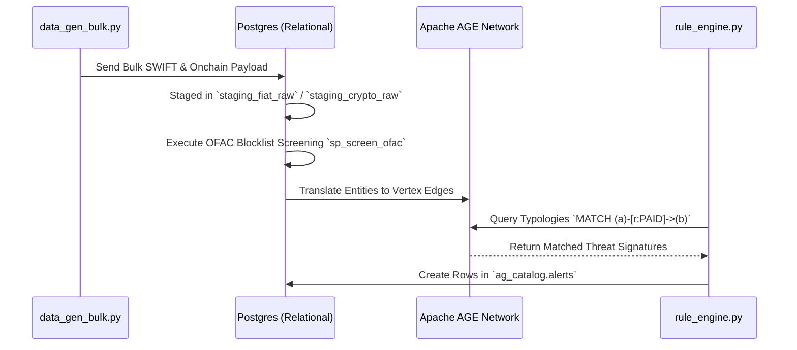

# Synthetic Demo & Legacy Pipeline Operations Guide

This document covers the secondary/demo ETL data flow utilized primarily for development testing, automated mock scenario generation, and testing legacy Python integration without passing through the primary Dagster scheduler.

## Overview

Unlike the event-driven or scheduled Dagster production jobs, these scripts exist to instantiate a fully synthetic environment from scratch. Executing `run_demo_demo.py` orchestrates a controlled end-to-end load test simulating SWIFT/TradFi and On-Chain Crypto endpoints.

## Pipeline Architecture & Sequence

The Python-native batch processes rely on system calls mapping out five linear steps:

1. **Schema Validation (`ensure_schema_exists`)**: Validates if `staging_crypto_raw` exists in the graph database. If not, it executes raw initialization scripts (`01-init.sql`, etc.).
2. **Data Mocking (`data_gen_bulk.py`)**: Automates synthetic JSON/CSV payload generation representing suspicious and non-suspicious patterns.
3. **Staging Engine (`run_batch.py`)**: 
   - Normalizes disparate schemas into standardized arrays structure.
   - Pushes into `staging_fiat_raw` and `staging_crypto_raw` tables.
   - *Active Compliance Gate:* Triggers the OFAC Stored Procedure (`sp_screen_ofac()`).
4. **Graph Injection**: Directly injects data into the AGE extension utilizing standard relational bindings.
5. **Rule Intelligence (`rule_engine.py`)**: Sequentially iterates over the graph database analyzing raw typologies built via OpenCypher (e.g., Smurfing, Rapid Movement, Velocity rules).

## Operational Schema Mapping



## Running the Demo Engine

The demo automation acts as a self-contained environment validation tool. To run it:

```bash
cd aml_platform/etl
python run_demo_demo.py
```

> [!WARNING]
> While executing `run_demo_demo.py`, existing data inside the test graph tables may be truncated or merged. This script should never be triggered against actual production graph endpoints as it may inject synthetic payloads obfuscating live analysis.
