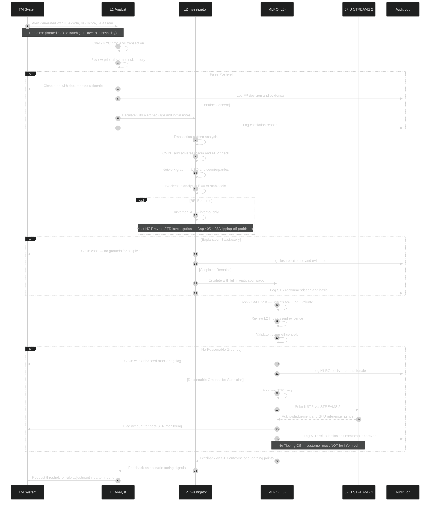
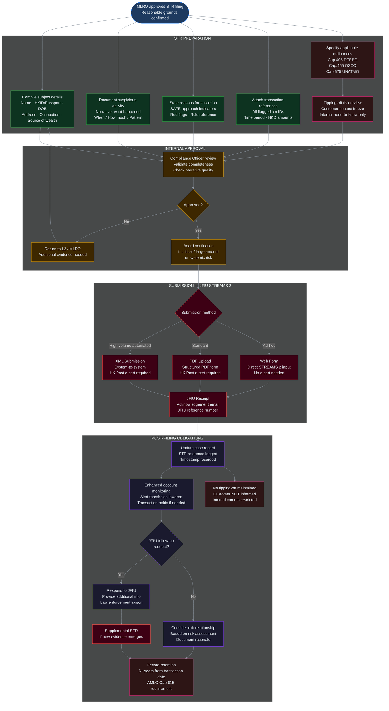
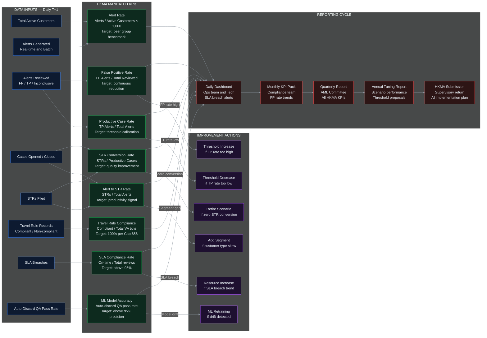
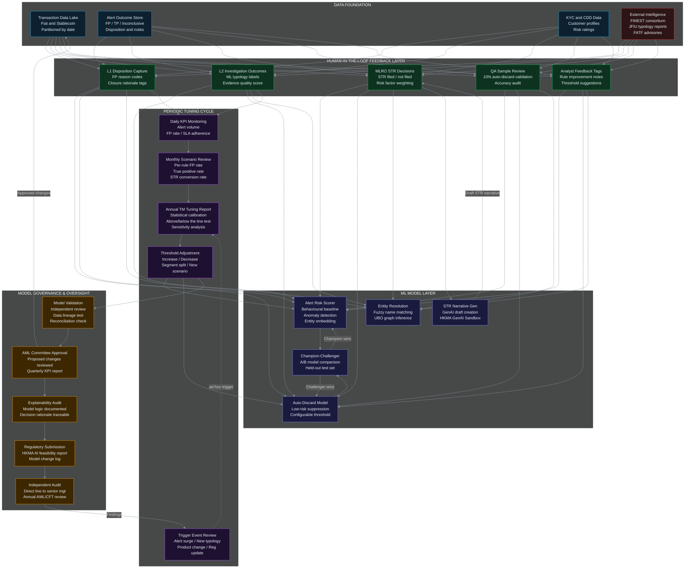

# Project Overwatch
## Full Requirements Specification
### Unified AML Transaction Monitoring Platform — Fiat & Stablecoin Transactions

> **Version:** 2.0 Converged
> **Regulatory Basis:** AMLO Cap.615 · Stablecoins Ordinance Cap.656 (eff. 1 Aug 2025) · HKMA AML/CFT Guideline · JFIU STREAMS 2 · FATF Rec.15 & 16 · MiCA (EU) · GENIUS Act (US)
> **Technology Stack:** Next.js · React · TypeScript · Python · FastAPI · PostgreSQL 16+ · Apache AGE · Apache Kafka · Apache Airflow · Temporal · Keycloak · Cytoscape.js
> **Prepared:** June 2026

---

## Table of Contents

1. [Executive Summary](#1-executive-summary)
2. [Problem Statement & Business Case](#2-problem-statement--business-case)
3. [Regulatory Framework](#3-regulatory-framework)
4. [Solution Architecture](#4-solution-architecture)
5. [Data Model](#5-data-model)
6. [End-to-End Detection Lifecycle](#6-end-to-end-detection-lifecycle)
7. [Alert Triage — L1/L2/L3 Swimlane](#7-alert-triage--l1l2l3-swimlane)
8. [STR Filing Workflow — JFIU STREAMS 2](#8-str-filing-workflow--jfiu-streams-2)
9. [Module 1: KPI Dashboard](#9-module-1-kpi-dashboard)
10. [Module 2: Case Management](#10-module-2-case-management)
11. [Module 3: Network Graph Visualization](#11-module-3-network-graph-visualization)
12. [Module 4: ETL Pipeline](#12-module-4-etl-pipeline)
13. [HKMA KPI Framework & Reporting Cycle](#13-hkma-kpi-framework--reporting-cycle)
14. [Continuous Improvement & Human-in-the-Loop](#14-continuous-improvement--human-in-the-loop)
15. [Detection Scenarios](#15-detection-scenarios)
16. [Non-Functional Requirements](#16-non-functional-requirements)
17. [Security & Compliance Controls](#17-security--compliance-controls)
18. [Implementation Roadmap](#18-implementation-roadmap)
19. [Governance & Risk Management](#19-governance--risk-management)

---

## 1. Executive Summary

**Project Overwatch** is a strategic initiative to design and implement a **Unified Transaction Monitoring Platform** that applies consistent AML, CTF, and sanctions screening controls across both fiat and regulated stablecoin payment rails — eliminating the compliance seams that financial crime currently exploits.

Stablecoin transaction volumes reached **$33 trillion globally in 2025**, a 72% year-on-year increase, and are projected to hit **$56 trillion by 2030**. Most on-chain illicit activity now involves stablecoins, with a significant and growing share involving conversion of illicit crypto funds into stablecoins then redemption into fiat via secondary bank accounts — a cross-rail layering technique entirely invisible to siloed monitoring systems.

The core design principle is **rail abstraction**: the compliance engine treats a HKD 10,000 SWIFT wire, a HKD 10,000 ACH transfer, and 10,000 USDC on-chain transfer with identical analytical rigour under a unified risk model, while preserving rail-specific contextual data for regulatory reporting.

**Key outcomes targeted:**
- 70–80% reduction in false positive alert rates vs traditional rule-based systems
- Unified customer 360 view across fiat and stablecoin activity
- Full regulatory examination readiness: HKMA, MiCA, FATF standards
- Single platform, single team, single audit trail for all rails

---

## 2. Problem Statement & Business Case

### 2.1 The Dual-Rail Compliance Gap

Financial institutions operating across both fiat and stablecoin rails have inherited a fragmented compliance architecture — separate monitoring systems, separate rule sets, and separate alert queues. This architecture is no longer fit for purpose.

| Challenge | Description | Impact |
|---|---|---|
| Fragmented Systems | Separate blockchain monitoring and fiat TM tools with no shared data layer | Blind spots at rail crossover; same customer, different risk profiles |
| Duplicate Rule Sets | Separate threshold configurations and alert queues per rail | Analyst overload; conflicting risk thresholds for the same customer |
| No Customer 360 View | Fiat and crypto activity visible in different systems | Cross-rail laundering invisible |
| 24/7 Blockchain vs Batch Fiat | On-chain 24/7 vs legacy batch cycles | Monitoring latency for stablecoin flows |
| Cross-Chain Fragmentation | Multi-chain bridges bypass issuer compliance layers | Travel Rule gaps in multi-chain flows |
| Unhosted Wallet Opacity | Self-custodied wallets have no built-in KYC | Higher manual review burden; sanctions evasion risk |
| High False Positive Rate | Traditional systems flag 90–95% of alerts as non-suspicious | Compliance burnout; genuine risks buried in noise |
| Cross-Rail Layering | Illicit funds converted to stablecoin then redeemed as fiat | Undetectable without unified transaction history |

### 2.2 Strategic Business Risks of Inaction

- **Regulatory enforcement risk**: HKMA, EU, and US regulators have signalled zero tolerance. Paxos's $48.5M fine is a direct precedent.
- **Reputational risk**: Public regulatory actions erode customer trust.
- **Revenue opportunity cost**: 52% of executives cite lower transaction costs as top reason for stablecoin adoption; 48% cite faster settlement. Institutions unable to compliantly support stablecoins will cede this market.
- **Criminal exploitation**: Sophisticated actors actively exploit the gap between fiat and crypto monitoring systems.

### 2.3 Quantified Business Case

| Metric | Projected Outcome |
|---|---|
| False positive reduction | 70–80% vs traditional rule-based baseline |
| Analyst efficiency | HSBC: 60%+ alert reduction, 2–4× more confirmed suspicious activity with AI |
| Cost savings | Elimination of duplicate vendor contracts, toolsets, and analyst workflows |
| Revenue enablement | Stablecoin flows projected at $56T by 2030; compliant institutions capture disproportionate share |
| Regulatory capital | Demonstrably robust AML controls may support more favourable supervisory treatment |

---

## 3. Regulatory Framework

### 3.1 Hong Kong

**AMLO Cap.615 — Anti-Money Laundering and Counter-Terrorist Financing Ordinance**

| Provision | Requirement |
|---|---|
| Sch.2 s.2 | Customer Due Diligence (CDD) for transactions at or above HKD 8,000 |
| Sch.2 s.10 | Enhanced Due Diligence (EDD) for PEP customers |
| Sch.2 s.13A | Travel Rule: originator/beneficiary data sharing for stablecoin transfers |
| Sch.2 s.12 | Wire transfer CDD: fiat wire >= HKD 8,000 |
| Cap.615 s.25A | Tipping-off prohibition: customer must NOT be informed of STR investigation |
| Record retention | 6+ years from account closure |

**Stablecoins Ordinance Cap.656** (effective 1 August 2025)
- Licensed Stablecoin Issuers (SIs) are classified as "financial institutions" under AMLO Cap.615
- CDD required for all transactions at or above HKD 8,000, covering both custodial and unhosted wallets
- Enhanced monitoring for transfers to/from unhosted wallets (screening, transaction limits, blocking capability)
- Ecosystem monitoring: issuers must monitor tokens beyond direct customers across the full stablecoin circulation lifecycle
- Blacklisting and freezing of wallets linked to sanctioned or illicit actors
- **Zero-threshold** approach for Travel Rule data capture; enhanced data fields required above HKD 8,000

**HKMA Expectations (AML/CFT Guideline + Thematic Reviews)**
- Blockchain analytics tools for wallet screening on an ongoing basis
- Real-time monitoring for high-value and cross-border stablecoin transfers
- AI/ML implementation plan submission (HKMA GenAI Sandbox framework)
- Quarterly KPI reporting to AML Committee; annual tuning report submission

**JFIU STREAMS 2** — Suspicious Transaction Report filing system
- Three submission methods: XML (system-to-system, HK Post e-cert required), PDF upload (HK Post e-cert required), Web form (no e-cert)
- Applicable ordinances: Cap.405 (DTRPO), Cap.455 (OSCO), Cap.575 (UNATMO)

### 3.2 European Union — MiCA

- Stablecoin provisions fully applicable from **30 June 2024**
- E-money tokens (EMTs): value pegged to single fiat currency; EMI/credit institution licensing required
- Asset-referenced tokens (ARTs): pegged to basket of assets; stringent reserve and disclosure requirements
- Cap of 1 million transactions per day for non-EU currency stablecoins
- Full Travel Rule compliance under Transfer of Funds Regulation (TFR) for all CASPs from December 2024
- EBA guidance: risk-based approach; high-risk transactions flagged and reviewed in real time

### 3.3 United States — GENIUS Act & BSA

- GENIUS Act (mid-2025): federal licensing for all stablecoin issuers; explicit Bank Secrecy Act (BSA) requirements
- Comprehensive AML/CFT programs with formal risk assessments
- Real-time monitoring across all major blockchains with automated detection
- Foreign stablecoin issuers accessing US markets: identical AML and sanctions compliance standards

### 3.4 FATF Global Standards

- **Recommendation 15**: Virtual assets — risk-based supervision
- **Recommendation 16**: Travel Rule — following June 2025 FATF Plenary revision:
  - Covers peer-to-peer cross-border transfers above USD/EUR 1,000
  - Beneficiary verification now a **requirement**, not recommendation
  - Designed to work within ISO 20022
  - 42 countries Travel Rule compliant as of early 2026; 85 of 117 jurisdictions have passed or are actively passing legislation
- 2026 FATF targeted report: advanced blockchain analytics, smart-contract-based controls, cross-border supervisory coordination

### 3.5 Regulatory Control Mapping

| Control | AMLO Cap.615 | Cap.656 | HKMA Guideline | FATF R.15 | FATF R.16 | MiCA | BSA/GENIUS |
|---|---|---|---|---|---|---|---|
| CDD/KYC | ✓ Sch.2 s.2 | ✓ | ✓ | ✓ | | ✓ | ✓ |
| EDD for PEP | ✓ Sch.2 s.10 | | ✓ | ✓ | | ✓ | ✓ |
| UBO identification | ✓ Sch.2 s.2 | | ✓ | ✓ | | ✓ | ✓ |
| Sanctions screening | ✓ | ✓ | ✓ | ✓ | | ✓ | ✓ |
| Travel Rule (fiat) | ✓ Sch.2 s.12 | | | | ✓ | ✓ TFR | ✓ |
| Travel Rule (stablecoin) | ✓ Sch.2 s.13A | ✓ | ✓ | | ✓ | ✓ TFR | ✓ |
| Blockchain analytics | | ✓ | ✓ | ✓ | | ✓ | ✓ |
| Unhosted wallet EDD | | ✓ | ✓ | ✓ | | ✓ | |
| Ecosystem monitoring | | ✓ | ✓ | | | ✓ | |
| STR/SAR filing | ✓ | ✓ | ✓ | ✓ R.20 | | ✓ | ✓ |
| Immutable audit log | ✓ 6yr | ✓ | ✓ | ✓ | | ✓ | ✓ 7yr |
| KPI/Tuning reporting | | | ✓ | | | | |
| AI model governance | | | ✓ GenAI | | | | |

---

## 4. Solution Architecture

### 4.1 Architecture Principles

1. **Rail abstraction**: A normalisation layer translates fiat and on-chain blockchain events into a common transaction schema before monitoring — ensuring uniform analytical treatment regardless of origin rail
2. **Real-time processing**: Sub-second transaction screening for both fiat and stablecoin, supporting 24/7 blockchain operations alongside traditional banking hours
3. **Horizontal scalability**: Microservices architecture enabling independent scaling of monitoring, screening, and case management components under peak load
4. **Explainability and governance**: All AI model outputs accompanied by human-readable explanations; all rule and model changes version-controlled with mandatory approval workflows

### 4.2 System Architecture

```
┌─────────────────────────────────────────────────────────────────┐
│                    DATA INGESTION LAYER                         │
│  ┌─────────────────┐    ┌──────────────────────────────────┐    │
│  │  FIAT RAIL      │    │  STABLECOIN / ON-CHAIN RAIL      │    │
│  │  SWIFT / MX     │    │  Blockchain Nodes (ETH,TRON...)  │    │
│  │  ACH / SEPA     │    │  USDC, USDT, HKDG, TCHN         │    │
│  │  FPS / CHATS    │    │  Multi-chain Bridge Events       │    │
│  │  Card Networks  │    │  VASP Transfer Events            │    │
│  └────────┬────────┘    └───────────────┬──────────────────┘    │
│           └──────────────┬──────────────┘                       │
│                          ▼                                      │
│           ┌──────────────────────────────┐                      │
│           │   NORMALISATION ENGINE       │                      │
│           │   Common Transaction Schema  │                      │
│           │   ISO 20022 Data Mapping     │                      │
│           └──────────────┬───────────────┘                      │
└──────────────────────────┼──────────────────────────────────────┘
                           ▼
┌──────────────────────────────────────────────────────────────────┐
│                  MONITORING & INTELLIGENCE LAYER                 │
│  ┌─────────────────┐  ┌──────────────┐  ┌────────────────────┐   │
│  │ RULE-BASED TM   │  │  AI/ML       │  │  BLOCKCHAIN        │   │
│  │ Configurable    │  │  ANOMALY     │  │  ANALYTICS ENGINE  │   │
│  │ Detection       │  │  DETECTION   │  │  On-chain risk     │   │
│  │ Scenarios       │  │  Behavioural │  │  scoring; graph    │   │
│  │                 │  │  baselining  │  │  analytics         │   │
│  └────────┬────────┘  └──────┬───────┘  └──────────┬─────────┘   │
│           └──────────────────┴──────────────────────┘            │
│                          ▼                                       │
│  ┌────────────────────────────────────────────────────────────┐  │
│  │           UNIFIED RISK SCORING ENGINE                      │  │
│  │    Customer 360 Risk Profile — Fiat + Stablecoin           │  │
│  └────────────────────────────────┬───────────────────────────┘  │
│                                   ▼                              │
│  ┌────────────────────────────────────────────────────────────┐  │
│  │         SANCTIONS & PEP SCREENING MODULE                   │  │
│  │  Real-time: OFAC, UN, EU, HK + On-chain entity lists       │  │
│  └────────────────────────────────┬───────────────────────────┘  │
│                                   ▼                              │
│  ┌────────────────────────────────────────────────────────────┐  │
│  │              TRAVEL RULE ENGINE                            │  │
│  │  ISO 20022 fiat leg + VASP-to-VASP stablecoin leg          │  │
│  └────────────────────────────────┬───────────────────────────┘  │
└──────────────────────────────────┼───────────────────────────────┘
                                   ▼
┌──────────────────────────────────────────────────────────────────┐
│                  CASE MANAGEMENT & REPORTING LAYER               │
│  ┌─────────────────────┐  ┌───────────────────────────────────┐  │
│  │  UNIFIED CASE       │  │   REGULATORY REPORTING MODULE     │  │
│  │  MANAGEMENT         │  │   STR/SAR Generation              │  │
│  │  Single alert       │  │   HKMA / MiCA / FinCEN reporting  │  │
│  │  queue; RBAC;       │  │   Version-controlled audit logs   │  │
│  │  audit trails       │  └───────────────────────────────────┘  │
│  └─────────────────────┘                                         │
└──────────────────────────────────────────────────────────────────┘
```

### 4.3 Processing Lanes

| Lane | Trigger | Target Latency | Key Outputs |
|---|---|---|---|
| ⚡ Real-Time | On transaction ingestion | < 1 second | Sanctions block, Travel Rule hold, blockchain risk alert, high-value alert |
| 🕐 T+1 Batch | Nightly 00:00–06:00 HKT | Overnight | Structuring, velocity vs baseline, dormant account, KPI snapshot |
| 🕸️ Graph Analytics | After `T1_GRAPH_REFRESH` (04:00 HKT) | 04:00–05:00 HKT | Community detection, flagged clusters, node risk scores |
| 📊 KPI Daily Summary | After all T+1 jobs (05:00 HKT) | 05:00–06:00 HKT | kpi_snapshot, rail breakdown, heatmap, scenario KPIs |

### 4.4 T+1 Batch Processing Schedule (HKT)

| Time | Job | Description |
|---|---|---|
| 00:00 | `T1_WATCHLIST_SYNC` | Refresh watchlist_entry from OFAC / UNSC / EU / HMT / HKMA feeds |
| 00:30 | `T1_SCREENING` | Re-screen all parties against refreshed watchlists |
| 01:00 | `T1_TM_RUN` | Execute all BATCH-mode detection scenarios on T-1 transactions |
| 02:00 | `T1_BEHAVIOUR_REFRESH` | Recompute customer_behaviour_baseline and wallet_behaviour_baseline |
| 03:00 | `T1_TRAVEL_RULE_CHECK` | Audit stablecoin Travel Rule completeness |
| 04:00 | `T1_GRAPH_REFRESH` | Materialise graph nodes and edges; run community detection |
| 05:00 | `T1_KPI_CALCULATION` | fn_compute_daily_kpi() — upsert kpi_snapshot and breakdowns |
| 06:00 | `T1_ALERT_AGING` | Flag SLA breaches; trigger supervisor escalations |

### 4.5 Architecture Alignment by Module

| Module | Frontend Stack | Backend Stack | Database |
|---|---|---|---|
| KPI Dashboard | Next.js, TanStack Query, ECharts | FastAPI, Temporal (alert triggers), Redis (cache) | PostgreSQL (aggregated metrics), Redis |
| Case Management | Next.js, TanStack Table, React Hook Form + Zod | FastAPI, Temporal (workflow), Keycloak (RBAC) | PostgreSQL (cases, audit), OpenSearch (full-text) |
| Graph Visualization | Cytoscape.js, React, TanStack Query | FastAPI (graph routes), AGE query service | PostgreSQL + Apache AGE (aml_graph) |
| ETL Pipeline | Airflow admin view (portal iframe) | Apache Airflow DAGs, Python ETL services | PostgreSQL + Apache AGE (write targets) |

---

## 5. Data Model

The converged data model spans **40 tables across 7 PostgreSQL schemas**.

### 5.1 Schema Overview

| Schema | Tables | Purpose |
|---|---|---|
| `aml_core` | 11 | KYC, customer demographics, fiat + stablecoin transactions, Travel Rule |
| `aml_detection` | 4 | Detection engine, sanctions/PEP screening, alert lifecycle |
| `aml_case_mgmt` | 6 | Investigation workflow, JFIU STREAMS 2 STR filing |
| `aml_graph` | 8 | Apache AGE graph analytics, score history, path cache |
| `aml_behaviour` | 2 | Customer and wallet behavioural baselines |
| `aml_reporting` | 7 | HKMA KPI dashboard, per-rail breakdown, regulatory submissions |
| `aml_audit` | 2 | Immutable audit trail, RBAC users |

### 5.2 Schema: `aml_core` — KYC, Accounts, Transactions

#### `party` — Customer Demographics Registry
*Regulatory basis: AMLO Cap.615 Sch.2 s.2 (CDD); s.10 (PEP EDD)*

| Field | Type | Notes |
|---|---|---|
| party_id | uuid PK | |
| party_type | varchar | INDIVIDUAL\|CORPORATE\|FI\|TRUST |
| full_name | varchar | NOT NULL |
| hkid_passport_no | varchar | |
| date_of_birth | date | |
| nationality_code | char(2) | ISO 3166-1 |
| country_of_residence | char(2) | ISO 3166-1 |
| registered_address | varchar | |
| employer_name | varchar | Source-of-wealth support |
| occupation_category | varchar | EMPLOYED\|SELF_EMPLOYED\|RETIRED\|STUDENT\|OTHER |
| customer_segment | varchar | RETAIL\|SME\|CORPORATE\|VASP\|INSTITUTIONAL |
| customer_risk_rating | varchar | LOW\|MEDIUM\|HIGH\|PEP\|SANCTIONED |
| is_pep | boolean | |
| is_sanctioned | boolean | |
| sanctions_list_ref | varchar | |
| is_beneficial_owner_identified | boolean | |
| onboarding_channel | varchar | FACE_TO_FACE\|REMOTE\|iAM_SMART |
| source_of_wealth | varchar | EMPLOYMENT\|BUSINESS\|INHERITANCE\|INVESTMENT\|OTHER |
| source_of_funds | varchar | SALARY\|BUSINESS_PROCEEDS\|LOAN\|OTHER |
| declared_annual_income_hkd | decimal | Behavioural baseline anchor |
| expected_txn_profile | varchar | LOW\|MEDIUM\|HIGH |
| expected_product_usage | varchar | FIAT_ONLY\|STABLECOIN_ONLY\|BOTH |
| cdd_last_reviewed_at | timestamp | |
| edd_required_at | timestamp | |
| is_active | boolean | |
| created_at | timestamp | |

#### `party_document`
| Field | Type | Notes |
|---|---|---|
| doc_id | uuid PK | |
| party_id | uuid FK | → party |
| doc_type | varchar | HKID\|PASSPORT\|BR\|CI\|POA |
| doc_number | varchar | |
| expiry_date | date | |
| issuing_country | char(2) | |
| is_verified | boolean | |
| verified_at | timestamp | |

#### `party_relationship`
| Field | Type | Notes |
|---|---|---|
| rel_id | uuid PK | |
| party_id_from | uuid FK | → party |
| party_id_to | uuid FK | → party |
| relationship_type | varchar | DIRECTOR\|SHAREHOLDER\|BENEFICIAL_OWNER\|GUARANTOR\|TRUSTEE\|AUTHORIZED_SIGNATORY |
| ownership_percentage | decimal | |
| effective_from | date | |
| effective_to | date | |

#### `beneficial_owner` — UBO Chain
*Regulatory basis: AMLO Cap.615 Sch.2 s.2; >=25% ownership threshold*

| Field | Type | Notes |
|---|---|---|
| bo_id | uuid PK | |
| party_id | uuid FK | The UBO individual |
| entity_id | uuid FK | The entity they ultimately own/control |
| ownership_pct | decimal | >=25% threshold per AMLO |
| control_type | varchar | DIRECT\|INDIRECT\|EFFECTIVE |
| cr_number | varchar | Companies Registry reference |
| verified_date | date | |
| is_active | boolean | |

#### `pep_record`
| Field | Type | Notes |
|---|---|---|
| pep_id | uuid PK | |
| party_id | uuid FK | → party |
| pep_category | varchar | DOMESTIC\|FOREIGN\|IO\|FAMILY\|CLOSE_ASSOCIATE |
| jurisdiction | char(3) | |
| list_source | varchar | World-Check\|Refinitiv\|Dow Jones\|Manual |
| status | varchar | CONFIRMED\|DISMISSED\|UNDER_REVIEW |
| identified_date | date | |
| dismissed_date | date | |
| reviewed_by_user_id | uuid FK | → aml_user |

#### `watchlist_entry`
| Field | Type | Notes |
|---|---|---|
| watchlist_id | uuid PK | |
| list_type | varchar | OFAC_SDN\|UNSC\|EU\|HMT\|HKMA_SANCTIONED\|PEP_GLOBAL\|PEP_HK\|INTERPOL |
| listed_name | varchar | NOT NULL |
| alias_names | text | |
| entity_type | varchar | INDIVIDUAL\|ENTITY |
| listing_date | date | |
| delisting_date | date | |
| listing_reason | varchar | |
| is_active | boolean | |
| last_synced_at | timestamp | Updated by T1_WATCHLIST_SYNC |

#### `account` — Unified Fiat & Wallet Account
| Field | Type | Notes |
|---|---|---|
| account_id | uuid PK | |
| account_type | varchar | CURRENT\|SAVINGS\|FIXED_DEPOSIT\|SVF\|STABLECOIN_WALLET\|CRYPTO_WALLET |
| account_rail | varchar | FIAT\|STABLECOIN — primary discriminator |
| account_number | varchar | |
| currency_code | char(3) | HKD\|USD\|USDT\|USDC\|HKDG\|TCHN |
| institution_code | varchar | BIC\|LEI |
| account_status | varchar | ACTIVE\|DORMANT\|FROZEN\|CLOSED |
| account_risk_rating | varchar | LOW\|MEDIUM\|HIGH |
| current_balance | decimal | |
| blockchain_address | varchar | On-chain wallet address for Travel Rule |
| blockchain_network | varchar | ETH\|TRON\|BNB\|POLYGON\|SOLANA |
| is_hosted_wallet | boolean | |
| wallet_custody_type | varchar | HOSTED\|UNHOSTED\|EXCHANGE_CUSTODIED\|MULTI_SIG |
| opened_at | timestamp | |
| created_at | timestamp | |

#### `account_party_link`
| Field | Type | Notes |
|---|---|---|
| link_id | uuid PK | |
| account_id | uuid FK | → account |
| party_id | uuid FK | → party |
| role | varchar | OWNER\|JOINT_HOLDER\|AUTHORISED_SIGNATORY\|BENEFICIARY |
| effective_from | date | |
| effective_to | date | |

#### `transaction` — Unified Transaction Table
*Partitioned by `initiated_at` (monthly). `txn_rail` is the primary discriminator.*

| Field | Type | Notes |
|---|---|---|
| txn_id | uuid PK | |
| txn_reference | varchar | |
| txn_rail | varchar | FIAT\|STABLECOIN — primary discriminator |
| txn_channel | varchar | SWIFT\|CHATS\|FPS\|JETCO\|ACH\|RTGS\|BLOCKCHAIN\|SVF\|CARD |
| txn_type | varchar | CREDIT\|DEBIT\|TRANSFER\|MINT\|REDEEM\|SWAP\|BURN |
| originator_account_id | uuid FK | → account |
| beneficiary_account_id | uuid FK | → account |
| originator_party_id | uuid FK | → party |
| beneficiary_party_id | uuid FK | → party |
| txn_amount | decimal | |
| txn_currency | char(3) | |
| hkd_equivalent_amount | decimal | NOT NULL — FX-normalised for threshold evaluation |
| txn_status | varchar | PENDING\|COMPLETED\|FAILED\|HELD\|BLOCKED |
| initiated_at | timestamp | Partition key — monthly |
| settled_at | timestamp | |
| originator_country | char(2) | ISO 3166-1 |
| beneficiary_country | char(2) | ISO 3166-1 |
| is_cross_border | boolean | |
| purpose_code | varchar | |
| processing_mode | varchar | REALTIME\|BATCH |
| is_aml_processed | boolean | FALSE index for queue querying |
| ingestion_timestamp | timestamp | |
| batch_run_id | uuid FK | → batch_job |

#### `wire_transfer_detail` — Fiat Wire 1:1 Extension
| Field | Type | Notes |
|---|---|---|
| wire_id | uuid PK | |
| txn_id | uuid FK UNIQUE | → transaction |
| originator_name | varchar | |
| originator_account | varchar | |
| originator_id_no | varchar | HKID or passport |
| originator_institution_bic | varchar | |
| beneficiary_name | varchar | |
| beneficiary_account | varchar | |
| beneficiary_institution_bic | varchar | |
| threshold_tier | varchar | BELOW_8K\|AT_ABOVE_8K |
| verified_flag | boolean | |
| fps_name_match_status | varchar | MATCHED\|MISMATCH\|BYPASSED |
| fps_proxy_type | varchar | MOBILE\|EMAIL\|FPS_ID |

#### `stablecoin_txn_detail` — On-Chain 1:1 Extension
| Field | Type | Notes |
|---|---|---|
| sc_txn_id | uuid PK | |
| txn_id | uuid FK UNIQUE | → transaction |
| blockchain_tx_hash | varchar UNIQUE | Immutable on-chain ref |
| smart_contract_address | varchar | |
| originator_wallet_address | varchar | |
| beneficiary_wallet_address | varchar | |
| block_number | bigint | |
| token_standard | varchar | ERC-20\|TRC-20\|BEP-20 |
| token_amount | decimal | |
| token_symbol | varchar | USDT\|USDC\|HKDG\|TCHN |
| is_unhosted_wallet_involved | boolean | Triggers EDD per HKMA Cap.656 |
| ba_risk_score | decimal | Blockchain analytics 0-100 |
| ba_provider | varchar | CHAINALYSIS\|ELLIPTIC\|TRM |
| ba_risk_flags | text | MIXER\|DARKNET\|RANSOMWARE\|SANCTIONS_DIRECT |
| on_chain_timestamp | timestamp | |

#### `travel_rule_record`
*Regulatory basis: AMLO Cap.615 Sch.2 s.13A; Cap.656 zero-threshold approach*

| Field | Type | Notes |
|---|---|---|
| travel_rule_id | uuid PK | |
| txn_id | uuid FK UNIQUE | → transaction |
| compliance_status | varchar | COMPLIANT\|MISSING_DATA\|PENDING\|FAILED |
| originator_name | varchar | |
| originator_account_ref | varchar | |
| originator_address | varchar | |
| originator_cid_number | varchar | Required if >= HKD 8,000 |
| beneficiary_name | varchar | |
| beneficiary_account_ref | varchar | |
| beneficiary_institution_lei | varchar | |
| above_hkd8000_threshold | boolean | Zero-threshold; enhanced data above HKD 8k |
| data_transmission_protocol | varchar | IVMS101\|TRISA\|OPENVASP\|SYGNA |
| transmitted_at | timestamp | |
| missing_fields_list | text | |

### 5.3 Schema: `aml_detection`

#### `screening_result`
| Field | Type | Notes |
|---|---|---|
| screening_id | uuid PK | |
| txn_id | uuid FK | → transaction (nullable) |
| party_id | uuid FK | → party (nullable) |
| account_id | uuid FK | → account (nullable) |
| screen_type | varchar | SANCTIONS\|PEP\|ADVERSE_MEDIA\|BLOCKCHAIN_RISK\|HIGH_RISK_COUNTRY\|DUAL_USE_GOODS |
| screen_mode | varchar | REALTIME\|BATCH |
| match_status | varchar | NO_MATCH\|POTENTIAL_MATCH\|CONFIRMED_MATCH\|FALSE_POSITIVE |
| match_score | decimal | 0-100; pg_trgm fuzzy match similarity |
| matched_watchlist_ref | varchar | |
| matched_name | varchar | |
| screened_at | timestamp | |
| review_decision | varchar | CLEARED\|ESCALATED\|BLOCKED |
| reviewed_at | timestamp | |

#### `detection_scenario`
| Field | Type | Notes |
|---|---|---|
| scenario_id | uuid PK | |
| scenario_code | varchar | e.g. SCN_STRUCT_FIAT_01 |
| scenario_name | varchar | |
| scenario_category | varchar | STRUCTURING\|LAYERING\|PLACEMENT\|TRAVEL_RULE_BREACH\|BLOCKCHAIN_RISK\|UNHOSTED_WALLET\|VELOCITY\|PEP_MONITORING |
| applicable_rail | varchar | FIAT\|STABLECOIN\|BOTH |
| processing_mode | varchar | REALTIME\|BATCH\|BOTH |
| scenario_logic_description | text | |
| threshold_config | jsonb | Parameterised — no schema changes for tuning |
| lookback_window_days | integer | |
| severity | varchar | CRITICAL\|HIGH\|MEDIUM\|LOW |
| status | varchar | ACTIVE\|INACTIVE\|TESTING |
| regulatory_reference | varchar | AMLO\|HKMA_GUIDELINE\|FATF_REC |
| effective_from | date | |

#### `aml_alert`
| Field | Type | Notes |
|---|---|---|
| alert_id | uuid PK | |
| scenario_id | uuid FK | → detection_scenario |
| primary_txn_id | uuid FK | → transaction |
| primary_party_id | uuid FK | → party |
| alert_type | varchar | TRANSACTION\|CUSTOMER\|NETWORK\|SCREENING\|TRAVEL_RULE |
| alert_mode | varchar | REALTIME\|BATCH |
| alert_status | varchar | OPEN\|UNDER_REVIEW\|CLOSED_TP\|CLOSED_FP\|ESCALATED |
| alert_priority | varchar | CRITICAL\|HIGH\|MEDIUM\|LOW |
| risk_score | decimal | 0-100; ML model prioritisation |
| alert_description | text | |
| triggered_rule_detail | jsonb | Snapshot of rule params at firing time |
| flagged_amount_hkd | decimal | |
| alert_generated_at | timestamp | |
| assigned_analyst_id | uuid FK | → aml_user |
| sla_due_at | timestamp | |
| disposition | varchar | TRUE_POSITIVE\|FALSE_POSITIVE\|INCONCLUSIVE |
| closed_at | timestamp | |

#### `alert_transaction_link`
| Field | Type | Notes |
|---|---|---|
| link_id | uuid PK | |
| alert_id | uuid FK | → aml_alert |
| txn_id | uuid FK | → transaction |
| link_reason | varchar | |

### 5.4 Schema: `aml_case_mgmt`

#### `aml_case`
| Field | Type | Notes |
|---|---|---|
| case_id | uuid PK | |
| case_reference | varchar | CASE-2026-HK-00001 |
| primary_party_id | uuid FK | → party |
| case_type | varchar | INVESTIGATION\|SAR_PREPARATION\|STR_FILED\|EDD_REVIEW |
| case_status | varchar | OPEN\|UNDER_INVESTIGATION\|PENDING_STR\|STR_FILED\|CLOSED |
| case_priority | varchar | CRITICAL\|HIGH\|MEDIUM\|LOW |
| ml_typology | varchar | STRUCTURING\|LAYERING\|CRYPTO_MIXING\|DEFI_LAUNDERING\|SANCTIONS_EVASION |
| case_summary | text | |
| total_flagged_amount_hkd | decimal | |
| assigned_analyst_id | uuid FK | → aml_user |
| assigned_supervisor_id | uuid FK | → aml_user |
| opened_at | timestamp | |
| sla_due_at | timestamp | |
| str_filed | boolean | |
| str_id | uuid FK | → str_report |
| created_at | timestamp | |

#### `case_alert_link`
| Field | Type | Notes |
|---|---|---|
| link_id | uuid PK | |
| case_id | uuid FK | → aml_case |
| alert_id | uuid FK | → aml_alert |
| linked_at | timestamp | |

#### `case_party_link`
| Field | Type | Notes |
|---|---|---|
| link_id | uuid PK | |
| case_id | uuid FK | → aml_case |
| party_id | uuid FK | → party |
| party_role_in_case | varchar | SUBJECT\|ASSOCIATE\|COUNTERPARTY\|FACILITATOR |

#### `case_activity_log`
| Field | Type | Notes |
|---|---|---|
| log_id | uuid PK | |
| case_id | uuid FK | → aml_case |
| performed_by_user_id | uuid FK | → aml_user |
| activity_type | varchar | CASE_CREATED\|ASSIGNED\|NOTE_ADDED\|ESCALATED\|STR_DRAFTED\|STR_SUBMITTED\|CLOSED\|STATUS_CHANGED |
| activity_description | text | |
| performed_at | timestamp | |

#### `str_report` — JFIU STREAMS 2
| Field | Type | Notes |
|---|---|---|
| str_id | uuid PK | |
| case_id | uuid FK | → aml_case |
| str_reference | varchar | JFIU STREAMS 2 reference |
| str_status | varchar | DRAFT\|SUBMITTED\|ACKNOWLEDGED\|SUPPLEMENTAL |
| is_supplemental | boolean | |
| original_str_id | uuid FK | → str_report (for supplementals) |
| submission_channel | varchar | STREAMS2_WEBFORM\|STREAMS2_XML\|STREAMS2_PDF |
| reporting_institution_name | varchar | |
| reporting_officer_name | varchar | |
| subject_details | text | Name, HKID, DOB, address, accounts |
| suspicious_activity_description | text | |
| reasons_for_suspicion | text | SAFE approach indicators |
| applicable_ordinances | text | Cap.405\|Cap.455\|Cap.575 |
| total_amount_reported_hkd | decimal | |
| tipping_off_risk_assessed | boolean | |
| no_tipping_off_confirmed | boolean | Mandatory — AMLO Cap.615 s.25A |
| activity_period_from | date | |
| activity_period_to | date | |
| submitted_at | timestamp | |
| jfiu_case_ref | varchar | |

#### `str_transaction_link`
| Field | Type | Notes |
|---|---|---|
| link_id | uuid PK | |
| str_id | uuid FK | → str_report |
| txn_id | uuid FK | → transaction |

### 5.5 Schema: `aml_graph` — Network Graph Layer (Apache AGE)

#### `graph_node`
| Field | Type | Notes |
|---|---|---|
| node_id | uuid PK | |
| node_type | varchar | PARTY\|ACCOUNT\|TRANSACTION\|IP_ADDRESS\|DEVICE\|BLOCKCHAIN_ADDRESS\|INSTITUTION\|LEGAL_ENTITY |
| node_label | varchar | |
| source_entity_id | uuid | FK to source table |
| source_table | varchar | e.g. aml_core.party |
| risk_score | decimal | 0-100; updated by T1_GRAPH_REFRESH |
| node_properties | jsonb | Flexible attributes |
| is_flagged | boolean | |
| flagging_reason | varchar | |
| last_updated_at | timestamp | |

**Node type to source table mapping:**

| Node Type | Source Table | AML Use Case |
|---|---|---|
| PARTY | aml_core.party | Customer / UBO identification |
| ACCOUNT | aml_core.account | Fiat account fund flow |
| TRANSACTION | aml_core.transaction | Pattern nodes in flow graphs |
| BLOCKCHAIN_ADDRESS | stablecoin_txn_detail | On-chain wallet clustering |
| IP_ADDRESS | Digital footprint | Shared infrastructure detection |
| DEVICE | Device fingerprint | Coordinated mule detection |
| INSTITUTION | Correspondent banks | Correspondent risk analysis |
| LEGAL_ENTITY | Corporate structure | UBO chain traversal |

#### `graph_node_score_history`
| Field | Type | Notes |
|---|---|---|
| history_id | uuid PK | |
| node_id | uuid FK | → graph_node |
| previous_score | decimal | |
| new_score | decimal | |
| score_delta | decimal | GENERATED STORED column |
| change_reason | varchar | |
| changed_at | timestamp | |
| changed_by_job_id | uuid FK | → batch_job |

#### `graph_edge`
| Field | Type | Notes |
|---|---|---|
| edge_id | uuid PK | |
| source_node_id | uuid FK | → graph_node |
| target_node_id | uuid FK | → graph_node |
| edge_type | varchar | SENT_TO\|RECEIVED_FROM\|OWNS_ACCOUNT\|CONTROLS\|SAME_DEVICE\|SAME_IP\|BLOCKCHAIN_TX\|SAME_ADDRESS |
| edge_weight | decimal | Amount HKD or frequency |
| txn_count | integer | Aggregated transaction count on this edge |
| total_amount_hkd | decimal | |
| hop_count | integer | |
| edge_properties | jsonb | |
| event_timestamp | timestamp | |

#### `graph_edge_daily_agg`
| Field | Type | Notes |
|---|---|---|
| agg_id | uuid PK | |
| business_date | date | |
| source_node_id | uuid FK | → graph_node |
| target_node_id | uuid FK | → graph_node |
| edge_type | varchar | |
| txn_count | integer | |
| total_amount_hkd | decimal | |
| max_single_txn_hkd | decimal | |
| applicable_rail | varchar | FIAT\|STABLECOIN |

#### `graph_community`
| Field | Type | Notes |
|---|---|---|
| community_id | uuid PK | |
| community_algorithm | varchar | LOUVAIN\|LABEL_PROPAGATION\|WEAKLY_CONNECTED |
| run_date | date | |
| community_size | integer | |
| community_risk_score | decimal | |
| max_node_risk_score | decimal | |
| total_txn_amount_hkd | decimal | |
| is_suspicious | boolean | |
| investigation_status | varchar | UNREVIEWED\|UNDER_REVIEW\|CLEARED\|ESCALATED |
| linked_case_id | uuid FK | → aml_case |
| detected_at | timestamp | |
| reviewed_at | timestamp | |

#### `graph_node_community`
| Field | Type | Notes |
|---|---|---|
| gnc_id | uuid PK | |
| node_id | uuid FK | → graph_node |
| community_id | uuid FK | → graph_community |
| membership_score | decimal | |

#### `graph_analytics_run`
| Field | Type | Notes |
|---|---|---|
| run_id | uuid PK | |
| algorithm_name | varchar | PAGERANK\|BETWEENNESS_CENTRALITY\|LOUVAIN_COMMUNITY\|CYCLE_DETECTION\|SHORTEST_PATH\|TRIANGLE_COUNT\|WEAKLY_CONNECTED |
| run_type | varchar | BATCH\|INTERACTIVE |
| run_date | date | |
| triggered_by_alert_id | uuid FK | → aml_alert (nullable) |
| triggered_by_case_id | uuid FK | → aml_case (nullable) |
| nodes_analysed | integer | |
| edges_analysed | integer | |
| suspicious_clusters_found | integer | |
| started_at | timestamp | |
| completed_at | timestamp | |
| status | varchar | RUNNING\|COMPLETED\|FAILED |

#### `graph_path_query_cache`
| Field | Type | Notes |
|---|---|---|
| query_id | uuid PK | |
| case_id | uuid FK | → aml_case |
| alert_id | uuid FK | → aml_alert |
| source_node_id | uuid FK | → graph_node |
| target_node_id | uuid FK | → graph_node |
| algorithm | varchar | SHORTEST_PATH\|ALL_PATHS |
| result_path_nodes | text | UUID array |
| result_path_edges | text | UUID array |
| result_total_weight | decimal | |
| result_hop_count | integer | |
| result_json | jsonb | |
| queried_at | timestamp | |
| expires_at | timestamp | TTL for cache invalidation |
| is_suspicious | boolean | |

**Supported graph analytics algorithms:**

| Algorithm | AML Use Case |
|---|---|
| PageRank | Identify high-centrality hub accounts in money flow |
| Betweenness Centrality | Find intermediary/facilitation accounts in layering chains |
| Louvain Community | Detect smurfing rings and coordinated mule networks |
| Cycle Detection | Identify round-tripping and circular fund flows |
| Shortest Path | Trace fund flow between two flagged entities |
| Weakly Connected Components | Map full relationship clusters including cross-rail connections |
| Triangle Count | Detect concentrated mutual fund flows between tight groups |

### 5.6 Schema: `aml_behaviour` — Behavioural Baselines

#### `customer_behaviour_baseline`

| Field | Type | Notes |
|---|---|---|
| baseline_id | uuid PK | |
| party_id | uuid FK | → party |
| baseline_date | date | Updated daily by T1_BEHAVIOUR_REFRESH |
| lookback_days | integer | 90\|180\|365 |
| applicable_rail | varchar | FIAT\|STABLECOIN\|BOTH |
| avg_monthly_txn_count | integer | |
| avg_monthly_txn_hkd | decimal | |
| avg_single_txn_hkd | decimal | |
| unique_counterparties_30d | integer | |
| cross_border_txn_pct | integer | |
| most_used_channel | varchar | FPS\|SWIFT\|BLOCKCHAIN etc. |
| primary_jurisdiction | char(2) | ISO 3166-1 |
| stddev_txn_amount_hkd | decimal | For velocity threshold calibration |
| p95_txn_amount_hkd | decimal | 95th percentile — HKMA statistical tuning |
| p99_txn_amount_hkd | decimal | 99th percentile |
| peer_group_id | varchar | For peer segmentation |
| calculated_at | timestamp | |

#### `wallet_behaviour_baseline`

| Field | Type | Notes |
|---|---|---|
| wallet_baseline_id | uuid PK | |
| account_id | uuid FK | → account (stablecoin wallet) |
| blockchain_address | varchar | NOT NULL |
| baseline_date | date | |
| lookback_days | integer | |
| avg_monthly_on_chain_txn_count | integer | |
| avg_monthly_token_amount_hkd | decimal | |
| unique_wallet_counterparties_30d | integer | |
| cross_chain_txn_count_30d | integer | |
| avg_ba_risk_score_30d | decimal | |
| unhosted_wallet_interactions_30d | integer | |
| mixer_exposure_count_90d | integer | Risk flag: exposure to mixers |
| bridge_txn_count_30d | integer | Cross-chain bridge usage |
| dominant_token | varchar | USDT\|USDC\|HKDG\|TCHN |
| dominant_blockchain | varchar | ETH\|TRON\|BNB\|POLYGON |
| has_defi_exposure | boolean | DeFi protocol interactions |
| calculated_at | timestamp | |

### 5.7 Schema: `aml_reporting`

#### `batch_job`
| Field | Type | Notes |
|---|---|---|
| job_id | uuid PK | |
| job_name | varchar | |
| job_type | varchar | T1_TM_RUN\|T1_SCREENING\|T1_KPI_CALCULATION\|T1_GRAPH_REFRESH\|T1_TRAVEL_RULE_CHECK\|T1_ALERT_AGING\|T1_WATCHLIST_SYNC\|T1_BEHAVIOUR_REFRESH |
| job_status | varchar | PENDING\|RUNNING\|COMPLETED\|FAILED |
| batch_date | date | T: processing date |
| business_date | date | T-1: business date being processed |
| started_at | timestamp | |
| completed_at | timestamp | |
| txn_records_processed | bigint | |
| alerts_generated | bigint | |

#### `kpi_snapshot`
| Field | Type | Notes |
|---|---|---|
| kpi_id | uuid PK | |
| snapshot_date | date | |
| kpi_period | varchar | DAILY\|WEEKLY\|MONTHLY\|QUARTERLY |
| applicable_rail | varchar | FIAT\|STABLECOIN\|ALL |
| total_active_customers | integer | |
| total_transactions_count | bigint | |
| total_transactions_hkd | decimal | |
| total_alerts_generated | integer | |
| alerts_realtime | integer | |
| alerts_batch | integer | |
| true_positive_alerts | integer | |
| false_positive_alerts | integer | |
| false_positive_rate | decimal | **HKMA mandated KPI** |
| total_strs_filed | integer | |
| str_conversion_rate | decimal | STRs / Productive Cases — **HKMA mandated KPI** |
| alert_to_str_rate | decimal | |
| travel_rule_compliant_count | integer | |
| travel_rule_non_compliant_count | integer | |
| travel_rule_compliance_rate | decimal | |
| alert_rate_per_1000_customers | decimal | **HKMA mandated KPI** |
| avg_alert_review_hours | decimal | |
| sla_breach_count | integer | |
| sla_breach_rate | decimal | |
| high_risk_blockchain_alerts | integer | |
| unhosted_wallet_alerts | integer | |
| calculated_at | timestamp | |

#### `kpi_daily_rail_breakdown`
| Field | Type | Notes |
|---|---|---|
| breakdown_id | uuid PK | |
| snapshot_date | date | |
| applicable_rail | varchar | FIAT\|STABLECOIN |
| txn_count | bigint | |
| txn_total_hkd | decimal | |
| txn_cross_border_count | bigint | |
| txn_cross_border_hkd | decimal | |
| txn_by_channel | jsonb | e.g. {FPS: 1200, SWIFT: 340} |
| txn_by_type | jsonb | e.g. {TRANSFER: 800, MINT: 120} |
| alerts_total | integer | |
| alerts_critical | integer | |
| alerts_high | integer | |
| alerts_true_positive | integer | |
| alerts_false_positive | integer | |
| travel_rule_total | integer | |
| travel_rule_compliant | integer | |
| travel_rule_above_8k | integer | |
| travel_rule_above_8k_non_compliant | integer | |
| unhosted_wallet_txns | integer | |
| blockchain_risk_alerts | integer | |
| ba_avg_risk_score | decimal | |
| strs_filed | integer | |
| calculated_at | timestamp | |

#### `kpi_alert_heatmap`
| Field | Type | Notes |
|---|---|---|
| heatmap_id | uuid PK | |
| snapshot_date | date | |
| alert_hour | integer | 0–23 UTC+8 |
| scenario_id | uuid FK | → detection_scenario |
| applicable_rail | varchar | |
| alert_count | integer | |
| true_positive_count | integer | |
| total_amount_hkd | decimal | |
| calculated_at | timestamp | |

#### `scenario_kpi`
| Field | Type | Notes |
|---|---|---|
| scenario_kpi_id | uuid PK | |
| scenario_id | uuid FK | → detection_scenario |
| snapshot_date | date | |
| kpi_period | varchar | DAILY\|WEEKLY\|MONTHLY\|QUARTERLY |
| alerts_generated | integer | |
| true_positives | integer | |
| false_positives | integer | |
| false_positive_rate | decimal | |
| strs_from_scenario | integer | |
| avg_risk_score | decimal | |
| min_risk_score | decimal | |
| max_risk_score | decimal | |
| tuning_recommendation | varchar | INCREASE_THRESHOLD\|DECREASE_THRESHOLD\|RETIRE_SCENARIO\|NO_CHANGE |

#### `regulatory_submission_log`
| Field | Type | Notes |
|---|---|---|
| submission_id | uuid PK | |
| submission_type | varchar | STR_STREAMS2\|HKMA_TM_KPI_QUARTERLY\|HKMA_ANNUAL_TUNING\|STABLECOIN_QUARTERLY |
| reporting_period_from | date | |
| reporting_period_to | date | |
| submitted_at | timestamp | |
| regulator_ref | varchar | |
| status | varchar | PENDING\|SUBMITTED\|ACKNOWLEDGED\|REJECTED |

### 5.8 Schema: `aml_audit`

#### `aml_user`
| Field | Type | Notes |
|---|---|---|
| user_id | uuid PK | |
| full_name | varchar | |
| email | varchar | |
| role | varchar | ANALYST_L1\|ANALYST_L2\|SUPERVISOR\|MLRO\|COMPLIANCE_OFFICER\|GRAPH_ANALYST\|ADMIN\|READONLY |
| is_active | boolean | |
| last_login_at | timestamp | |
| created_at | timestamp | |

#### `audit_log` — Immutable, Partitioned by Year
| Field | Type | Notes |
|---|---|---|
| audit_id | uuid PK | |
| user_id | uuid FK | → aml_user |
| schema_name | varchar | |
| table_name | varchar | |
| record_id | uuid | |
| action | varchar | INSERT\|UPDATE\|DELETE\|VIEW\|EXPORT |
| old_values | jsonb | |
| new_values | jsonb | |
| ip_address | inet | |
| user_agent | varchar | |
| performed_at | timestamp | |
| retention_expiry | date | 7 years — immutable |
| immutable_flag | boolean | TRUE; no DELETE grants on this table |

---

## 6. End-to-End Detection Lifecycle

The full AML detection lifecycle spans 8 stages from transaction ingestion to regulatory reporting and feedback loop.

```mermaid
%%{init: {'theme': 'dark', 'themeVariables': {'primaryColor': '#1e3a5f', 'primaryTextColor': '#e6edf3', 'primaryBorderColor': '#388bfd', 'lineColor': '#8b949e', 'fontFamily': 'ui-monospace, SFMono-Regular, monospace'}}}%%
flowchart TD

classDef system fill:#1e3a5f,stroke:#388bfd,color:#e6edf3
classDef process fill:#0d3320,stroke:#2ea043,color:#e6edf3
classDef decision fill:#3d2700,stroke:#e3a008,color:#e6edf3
classDef alertnode fill:#3d1a00,stroke:#e05c1a,color:#e6edf3
classDef regulatory fill:#3d0014,stroke:#f85149,color:#e6edf3
classDef closed fill:#1a1a1a,stroke:#555555,color:#aaaaaa

subgraph INGEST["1. TRANSACTION INGESTION"]
  direction LR
  T1["Fiat Transaction\nSWIFT / FPS / CHATS / RTGS / CARD"]:::system
  T2["Stablecoin / VA Transaction\nOn-chain / Mint / Redeem / Bridge"]:::system
  T3["Transaction Enrichment\nHKD normalisation / FX / Country code"]:::process
end

subgraph SCREEN["2. REAL-TIME SCREENING"]
  direction LR
  S1["Sanctions Screening\nOFAC / UNSC / EU / HKMA Designated"]:::alertnode
  S2["PEP Screening\nDomestic / Foreign / IO / Family"]:::alertnode
  S3["Blockchain Analytics\nRisk score 0-100 (Chainalysis/Elliptic/TRM)"]:::alertnode
  S4["Travel Rule Check\nZero-threshold stablecoin\nHKD 8,000 data requirement"]:::alertnode
end

subgraph DET["3. DETECTION ENGINE"]
  direction LR
  D1["Real-Time Rules\nSanctions match / High-value\nTravel Rule breach / Rapid layering"]:::system
  D2["T+1 Batch Rules\nStructuring 30-day window\nVelocity vs baseline / Dormant"]:::system
  D3["ML Risk Scoring\nBehavioural analytics\nAlert prioritisation 0-100"]:::system
end

subgraph ALERT_MGMT["4. ALERT TRIAGE — L1 REVIEW"]
  A1["Alert Generated\nRule code / Risk score / SLA timer"]:::alertnode
  A2{"Auto-Discard?\nML score below threshold"}:::decision
  A3["L1 Analyst Review\nKYC profile / Expected behaviour / FP test"]:::process
  A4{"Clear as\nFalse Positive?"}:::decision
  A5["Sample QA Check\n10% of auto-discards\nvalidated by L2"]:::process
  A6["Escalate to L2\nAlert package / Initial notes"]:::process
end

subgraph INVEST["5. L2 INVESTIGATION"]
  I1["Transaction Pattern Analysis\nStructuring / Layering / Velocity"]:::process
  I2["Customer Profile Review\nKYC / EDD / Source of wealth"]:::process
  I3["Network Analysis\nUBO chain / Counterparties / Graph"]:::process
  I4["OSINT & External Checks\nAdverse news / Court orders / LEA"]:::process
  I5["EDD / RFI\nRequest for Information (internal only)"]:::process
  I6{"Satisfactory\nExplanation?"}:::decision
  I7["Document Findings\nCase narrative / Evidence pack"]:::process
  I8["Recommend STR Filing\nEscalate to MLRO"]:::alertnode
  I9["Close Case — No Suspicion\nDocument rationale"]:::closed
end

subgraph MLRO_LAYER["6. MLRO DECISION — L3"]
  M1["MLRO Review\nValidate L2 findings / Apply SAFE test"]:::regulatory
  M2{"Reasonable Grounds\nfor Suspicion?"}:::decision
  M3["No STR — Monitor\nUpdate risk rating / Enhanced monitoring"]:::process
  M4["Approve STR Filing\nSign-off / Tipping-off check"]:::regulatory
end

subgraph STR_FILING["7. STR FILING — JFIU STREAMS 2"]
  direction LR
  F1["Draft STR\nSubject / Narrative / Txn refs"]:::regulatory
  F2["Internal Approval\nCompliance Officer sign-off"]:::regulatory
  F3["Submit via STREAMS 2\nXML / PDF / Web form\nHK Post e-cert required for XML/PDF"]:::regulatory
  F4["JFIU Acknowledgement\nReference number assigned"]:::regulatory
  F5["Post-STR Controls\nEnhanced monitoring\nNo tipping-off / Consider exit"]:::regulatory
end

subgraph POSTACT["8. POST-ACTION & RECORD KEEPING"]
  direction LR
  R1["Update Customer Risk Rating\nCDD / EDD refresh"]:::process
  R2["Record Retention\n6+ years — AMLO Cap.615"]:::process
  R3["Regulatory Reporting\nHKMA supervisory returns\nQuarterly KPI to AML Committee"]:::process
  R4["Feedback Loop\nAlert outcome → ML model\nScenario tuning signal"]:::process
end

T1 --> T3
T2 --> T3
T3 --> S1 & S2 & S3 & S4
S1 & S2 & S3 & S4 --> D1 & D2
D1 & D2 --> D3
D3 --> A1
A1 --> A2
A2 -->|Yes auto-discard| A5
A2 -->|No — queue for L1| A3
A5 -->|Pass| R4
A5 -->|QA fail| A3
A3 --> A4
A4 -->|Yes close FP| R4
A4 -->|No escalate| A6
A6 --> I1 & I2 & I3 & I4
I5 -.->|if needed| I2
I1 & I2 & I3 & I4 --> I6
I6 -->|Yes| I9
I6 -->|No| I7
I7 --> I8
I8 --> M1
M1 --> M2
M2 -->|No| M3
M3 --> R1
M2 -->|Yes| M4
M4 --> F1 --> F2 --> F3 --> F4 --> F5
F5 --> R1
I9 --> R1
R1 --> R2 & R3 & R4
```



---

## 7. Alert Triage — L1/L2/L3 Swimlane

The three-tier review model enforces separation of duties, RBAC-gated escalation, and AMLO tipping-off controls at every stage.



### 7.1 RBAC Role Matrix

| Role | Create Case | Edit Case | Approve Escalation | Override Disposition | Approve STR | Configure Rules | View Board Reports |
|---|---|---|---|---|---|---|---|
| Analyst L1 | ✓ | Own only | Request only | ✗ | ✗ | ✗ | ✗ |
| Analyst L2 | ✓ | Assigned | Request only | ✗ | ✗ | ✗ | ✗ |
| Supervisor | ✓ | All team | ✓ Approve/reject | ✓ | ✗ | ✗ | Team only |
| MLRO (L3) | ✓ | All | ✓ | ✓ | ✓ | ✗ | ✓ |
| Compliance Officer | ✓ | All | ✓ | ✓ | ✓ | ✗ | ✓ |
| Compliance Admin | ✓ | All | ✓ | ✓ | ✓ | ✓ | ✓ |
| Graph Analyst | View | View | ✗ | ✗ | ✗ | ✗ | ✗ |
| System Admin | System | System | System | System | ✗ | ✓ | ✓ |

### 7.2 SLA Targets

| Priority | Response Target | Resolution Target |
|---|---|---|
| Critical (P1) | 15 minutes | 4 hours (24/7) |
| High (P2) | 30 minutes | 8 hours (24/7) |
| Medium (P3) | 1 hour | 1 business day |
| Low (P4) | 2 hours | 2 business days |

---

## 8. STR Filing Workflow — JFIU STREAMS 2



---

## 9. Module 1: KPI Dashboard

### 9.1 Functional Requirements

**FR-D01 — KPI Metrics Display**
The dashboard must display the following AML operational KPIs in real time, updated at intervals not exceeding 60 seconds for live alert queues:
- Alert volume (total, by rule, by risk tier, by channel)
- Alert-to-case conversion rate
- False-positive rate and trend line
- SAR/STR filing volume and status
- Average case resolution time (time-to-close)
- Queue backlog count and aging distribution
- SLA compliance percentage per investigator and team
- Customer risk tier breakdown (low, medium, high, PEP, sanctions)
- KYC completion rate
- Cost-per-case

**FR-D02 — Traffic-Light Indicators**
Each KPI card must display a three-level traffic-light indicator (green / amber / red) against configurable thresholds. Threshold values must be configurable per role without requiring a code deployment.

**FR-D03 — Alert Volume Charts**
The dashboard must render time-series charts for alert volume, SAR filing volume, and false-positive rate across configurable rolling windows (24h, 7d, 30d, 90d). Charts must support zoom, pan, and data-point inspection using ECharts.

**FR-D04 — Tiered Alert Notification**

| Tier | Condition | Delivery |
|---|---|---|
| Critical | High-risk, threshold-amount breach | Immediate push notification + email |
| High | SLA risk, escalation pending | In-app + email digest every 2 hours |
| Medium | Routine monitoring pattern | Aggregated daily digest |
| Low / Informational | Informational only | In-portal only, no push |

**FR-D05 — Analyst Operational View**
Dedicated view showing alert volume, backlog, resolved, escalated, and throughput trend updated in real time. Managers see aggregated team-level views.

**FR-D06 — Rule and Scenario Performance**
Per-rule metrics: hit rate, false-positive rate, cases generated, last modification. Rules with FP rate above configurable threshold highlighted automatically.

**FR-D07 — Exportable Compliance Reports**
Export dashboard snapshots as PDF and CSV for board reporting, regulator inspection, and internal audit.

### 9.2 Frontend Requirements

| Requirement | Detail |
|---|---|
| Technology | Next.js App Router, TanStack Query for polling/cache, ECharts for time-series |
| Refresh strategy | TanStack Query refetchInterval for live KPI cards; WebSocket or SSE for critical alert counters |
| Layout | KPI cards row → trend charts → alert queue summary table |
| Responsive | Full-width at 1280px+; KPI cards stack vertically at ≤768px |
| Skeleton states | All KPI cards and charts must render shimmer skeletons during load |
| Accessibility | WCAG AA contrast, keyboard navigable, screen-reader labels on all chart elements |

### 9.3 Backend API (Module 1)

| Endpoint | Method | Description |
|---|---|---|
| /dashboard/kpis | GET | Returns all current KPI values with computed traffic-light status |
| /dashboard/alerts/timeseries | GET | Returns alert volume time-series for given window and granularity |
| /dashboard/rules/performance | GET | Returns per-rule hit rate, FP rate, case conversion |
| /dashboard/alerts/notifications | GET (SSE/WS) | Streams critical alert events to connected clients |
| /dashboard/export | POST | Generates PDF or CSV report snapshot |

---

## 10. Module 2: Case Management

### 10.1 Functional Requirements

**FR-C01 — Case Creation**
Cases must be created by two triggers:
- **Automatic**: alert fired by the TM rules engine; metadata pre-populated from alert payload (entity, rule ID, severity, triggering transaction IDs)
- **Manual**: investigator or supervisor creates from alert queue, graph investigation, or scheduled review

**FR-C02 — Case Lifecycle Workflow**
```
NEW → TRIAGED → UNDER_INVESTIGATION → ESCALATED → CLOSED (cleared or STR filed)
                                                 ↘ REOPENED
```
Workflow transitions enforce role-based gate conditions; stage durations tracked for SLA monitoring.

**FR-C03 — RBAC** (see Section 7.1)

**FR-C04 — Case Workspace**
Each case workspace must contain:
- Case summary (entity, risk score, alerts linked, assigned investigator, status, age)
- Transaction evidence viewer (linked transactions with amounts, timestamps, counterparties)
- Graph investigation panel (embedded Cytoscape.js fund-flow view for case entities)
- Timeline of all case actions in chronological order
- Notes and tagging with multi-investigator collaboration
- File attachment for supporting evidence (KYC docs, screenshots, external reports)
- SAR/STR preparation form with regulatory template fields

**FR-C05 — STR Generation**
Pre-populated STR from case data; jurisdiction-specific templates; exportable in JFIU STREAMS 2 format. Filing status and confirmation recorded in audit trail.

**FR-C06 — Audit Trail**
Every case action persisted as immutable, append-only audit event including: action type, actor (user ID, role, IP), timestamp (UTC, millisecond precision), before/after state, rule version and model version at time of alert, and MLRO sign-off.

**FR-C07 — SLA Tracking** (see Section 7.2)

**FR-C08 — Case Linking and Entity Resolution**
Cases with overlapping entities (shared account, device, customer, jurisdiction) surfaced as related and linkable into a case cluster. Entity resolution supports merge/link of duplicates across cases.

**FR-C09 — Integration Points**
- Transaction monitoring rules engine (alert ingestion)
- KYC/CDD provider (customer risk profile enrichment)
- Sanctions and PEP screening API (on-demand screening)
- Graph investigation service (network subgraph for case entities)
- Regulatory reporting system (STR export and submission confirmation)

### 10.2 Backend API (Module 2)

| Endpoint | Method | Description |
|---|---|---|
| /cases | GET / POST | List cases with filters; create manual case |
| /cases/{id} | GET / PATCH / DELETE | Retrieve, update, or soft-delete a case |
| /cases/{id}/transitions | POST | Execute workflow state transition with role validation |
| /cases/{id}/notes | GET / POST | List or add case notes |
| /cases/{id}/attachments | GET / POST | List or upload case attachments |
| /cases/{id}/audit | GET | Retrieve immutable audit log for the case |
| /cases/{id}/str | POST | Generate or submit STR document |
| /cases/{id}/graph | GET | Return Cytoscape-ready subgraph for case entities |
| /alerts | GET | List alerts with filtering and pagination |
| /alerts/{id}/case | POST | Convert alert to case |

---

## 11. Module 3: Network Graph Visualization

### 11.1 Functional Requirements

**FR-G01 — Entity and Relationship Model**

| Element | Types |
|---|---|
| Node types | Account, Customer, Merchant, Device, Wallet, Transaction, Case |
| Edge types | SENT, RECEIVED, OWNS, CONTROLS, SHARES_DEVICE, SHARES_IP, LINKED_TO_CASE, INTERMEDIARY_FOR |

Each node displays: entity ID, type label, risk score (color-coded), jurisdiction flag, KYC status, case count badge.
Each edge displays: amount or count (aggregated), direction, timestamp range, suspicious flag.

**FR-G02 — Interactive Traversal**
- Seed-node selection by entity search or from case workspace
- Configurable hop expansion (1–4 hops, default 2) by double-click or context menu
- Shortest path trace between any two nodes
- Circular flow detection highlighting
- Fan-in / fan-out view
- Collapse benign branches into summary node
- Filter by: time window, amount threshold, currency, jurisdiction, edge type, risk score

**FR-G03 — AML Pattern Highlighting**

| Pattern | Detection Method |
|---|---|
| Structuring/Smurfing | One node sending many sub-threshold transactions to multiple destinations (fan-out) |
| Layering | Long chain of intermediate accounts with rapid successive transfers |
| Integration | Funds converging from many sources into single endpoint (fan-in) |
| Round-tripping | Circular paths where funds return to originating account/UBO |
| Hub/bridge account | Node with unusually high betweenness centrality |

**FR-G04 — Graph Layout and Navigation**
- Force-directed (fCoSE) for relationship exploration
- Hierarchical / top-down for fund-flow chain tracing
- Navigation: zoom, pan, fit-to-view, full-screen

**FR-G05 — Node and Edge Inspection**
Click a node or edge → details panel without leaving canvas, showing: full entity attributes and risk history, linked alerts and cases, transaction list for selected relationship, option to open in case.

**FR-G06 — Graph Snapshot and Evidence Export**
Export current visible graph as PNG image or JSON elements file for case evidence, STR submissions, or regulatory reports.

### 11.2 Frontend Requirements

| Requirement | Detail |
|---|---|
| Technology | Cytoscape.js for graph rendering; React wrapper for event integration |
| Performance | Batch element addition via cy.batch(); cap default rendered elements at 1,000; progressive expansion beyond |
| Layouts | fCoSE for force-directed; dagre for hierarchical; server-side layout for large subgraphs |
| Edge aggregation | Multiple transactions between same pair render as one weighted edge; expandable on demand |
| Risk color coding | Green (low), amber (medium), red (high), black (sanctioned/PEP) |
| Undo/redo | Canvas state changes support undo/redo via in-memory state stack |

### 11.3 Backend API (Module 3)

| Endpoint | Method | Description |
|---|---|---|
| /graph/neighborhood/{entity_id} | GET | Returns 1–N hop subgraph centered on entity; ?depth=2 (max 3) |
| /graph/path | GET | Shortest path between from and to entity IDs within maxHops |
| /graph/case/{case_id} | GET | Full subgraph for all entities linked to a case |
| /graph/expand | POST | Expand from seed nodes with time/amount/type filters |
| /graph/patterns/{entity_id} | GET | Returns detected AML patterns for entity neighborhood |

All graph endpoints return Cytoscape-compatible elements JSON (nodes array + edges array) plus meta object with depth, truncation flag, pattern detections, and aggregate totals.

---

## 12. Module 4: ETL Pipeline

### 12.1 Functional Requirements

**FR-E01 — Data Source Ingestion**
- **Real-time streaming**: Apache Kafka topics (core banking transaction events, payment authorisations, alert triggers)
- **SWIFT and ISO 20022**: message parsing for MT/MX payment messages
- **REST API polling**: KYC provider enrichment, sanctions/PEP list updates, adverse media feeds
- **Batch file**: CSV, JSON, and XML from core banking, ledger export, historical migration
- **CDC (Change Data Capture)**: incremental updates from source relational databases via Debezium

**FR-E02 — Transformation and Enrichment**
- Normalize entity identifiers (account number, IBAN, wallet address, national ID) into stable canonical entity IDs
- Resolve duplicate and aliased entities using configurable match rules (exact, fuzzy, deterministic)
- Enrich transactions with KYC/CDD risk scores, PEP status, sanctions flags, and jurisdiction codes
- Standardise date/time fields to UTC ISO 8601
- Validate required fields against AML data model schema
- Apply data quality checks with rejection and quarantine for records failing validation
- Compute derived fields: transaction velocity indicators, peer-group deviation scores, running-balance snapshots

**FR-E03 — Load to PostgreSQL**
- Idempotent upserts (no duplicate records on retry or redelivery)
- Transactional writes per micro-batch with rollback on partial failure
- Table partitioning by date on Transaction table
- Separate schemas: core_banking, aml_staging, aml_clean, risk, case_management, audit
- Retention policy hooks for regulatory data holds and GDPR erasure requests

**FR-E04 — Load to Apache AGE**
After relational load, graph projection job must:
- Upsert vertices for: Account, Customer, Device, Wallet, Case
- Upsert edges for: SENT, RECEIVED, OWNS, CONTROLS, SHARES_DEVICE, LINKED_TO_CASE — with properties including amount, count, first_seen, last_seen, currency, risk_flag
- Incremental projection: only changed/new entities and relationships per pipeline run
- Graph projection within same PostgreSQL transaction as relational load where atomicity required

**FR-E05 — Pipeline Orchestration (Apache Airflow)**
DAGs must be defined for:
- Real-time/micro-batch transaction ingestion (trigger: Kafka consumer)
- Batch file processing (trigger: cron schedule or file arrival)
- Sanctions/PEP list refresh (trigger: daily cron at 00:00 HKT)
- Graph projection job (trigger: completion of relational load DAG)
- Data quality report generation (trigger: post-load)
- Historical back-fill and reprocessing (trigger: manual or rule-change event)

**FR-E06 — Data Quality and Observability**
- Report data quality metrics per run: record count, reject count, duplicate count, enrichment hit rate
- Target ≥99% data quality accuracy per run
- Alert data engineering team when quality falls below 99% threshold or pipeline stage fails
- Maintain pipeline lineage records mapping each output record to source file, topic, and transformation version
- Support on-demand reprocessing of specific time windows or message types via a Rerun Engine

### 12.2 Backend API (Module 4)

| Endpoint | Method | Description |
|---|---|---|
| /etl/runs | GET | List recent pipeline runs with status and quality metrics |
| /etl/runs/{id} | GET | Detail for a specific pipeline run |
| /etl/reprocess | POST | Trigger reprocessing of a time window or source |
| /etl/quality | GET | Current and historical quality metrics |
| /etl/graph/status | GET | Graph projection lag, last sync, vertex/edge counts |

---

## 13. HKMA KPI Framework & Reporting Cycle



### 13.1 KPI Definitions

| KPI | Formula | Target | Frequency |
|---|---|---|---|
| Alert Rate | Alerts / Active Customers × 1,000 | Peer group benchmark | Daily |
| False Positive Rate | FP Alerts / Total Reviewed | Continuous reduction (target <10%) | Daily |
| STR Conversion Rate | STRs Filed / Productive Cases | Quality improvement | Monthly |
| Alert to STR Rate | STRs / Total Alerts | Productivity signal | Monthly |
| SLA Compliance Rate | On-time Reviews / Total Reviews | >95% | Daily |
| Productive Case Rate | TP Alerts / Total Alerts | Threshold calibration | Weekly |
| Travel Rule Compliance | Compliant Stablecoin Txns / Total VA Txns | 100% per Cap.656 | Daily |
| ML Model Accuracy | Auto-discard QA Pass Rate | >95% precision | Monthly |

---

## 14. Continuous Improvement & Human-in-the-Loop



### 14.1 ML Model Inventory

| Model | Function | Training Signal | Governance |
|---|---|---|---|
| Alert Risk Scorer | Prioritise alerts 0-100 | Confirmed TP/FP dispositions from L1/L2 | Champion-challenger; quarterly retraining |
| Auto-Discard Model | Suppress low-risk alerts | L1 FP closures + L2 QA validation | 10% QA sample; accuracy target >95% |
| Entity Resolution | Fuzzy name matching; UBO graph inference | L2 merge/link decisions | Annual validation; data lineage test |
| STR Narrative Generator | GenAI draft creation | MLRO STR decisions; HKMA GenAI Sandbox | MLRO reviews all drafts; explainability required |

---

## 15. Detection Scenarios

### 15.1 Pre-Seeded Scenario Library

| Scenario Code | Category | Rail | Mode | Key Threshold | Behavioural Input |
|---|---|---|---|---|---|
| SCN_STRUCT_FIAT_01 | Structuring | FIAT | BATCH | HKD 120,000 CTR; 30-day window | customer_behaviour_baseline |
| SCN_STRUCT_SC_01 | Structuring | STABLECOIN | BATCH | HKD 8,000 Travel Rule threshold; 30-day window | wallet_behaviour_baseline |
| SCN_LAYER_RAPID_01 | Layering | BOTH | REALTIME | 24h roundtrip, 3+ hops | — |
| SCN_TRAVEL_RULE_01 | Travel Rule Breach | STABLECOIN | REALTIME | Zero threshold — any missing field | travel_rule_record |
| SCN_SANCTIONS_RT_01 | Sanctions Evasion | BOTH | REALTIME | 85% match score on screened entity | watchlist_entry |
| SCN_BLOCKCHAIN_RISK_01 | Blockchain Risk | STABLECOIN | REALTIME | ba_risk_score > 70 | stablecoin_txn_detail |
| SCN_UNHOSTED_WALLET_01 | Unhosted Wallet | STABLECOIN | BATCH | Monthly volume > HKD 50,000 | wallet_behaviour_baseline.unhosted_wallet_interactions_30d |
| SCN_VELOCITY_01 | Velocity | BOTH | REALTIME | 3× count or 5× amount vs 90d baseline | customer_behaviour_baseline.stddev_txn_amount_hkd |
| SCN_HIGHVAL_01 | High Value | BOTH | REALTIME | Single txn > HKD 1,000,000 | — |
| SCN_DORMANT_01 | Dormant Account | BOTH | BATCH | 12+ months dormant then active | account.account_status = DORMANT |
| SCN_PEP_01 | PEP Monitoring | BOTH | BATCH | EDD; approval threshold HKD 200,000 | pep_record.status = CONFIRMED |
| SCN_MIXER_EXPOSURE_01 | Mixer/Darknet Exposure | STABLECOIN | BATCH | >0 mixer exposure in 90 days | wallet_behaviour_baseline.mixer_exposure_count_90d |
| SCN_PROFILE_MISMATCH_01 | Profile Mismatch | BOTH | BATCH | Actual activity >> declared expected_txn_profile | customer_behaviour_baseline vs party.expected_txn_profile |
| SCN_CROSS_RAIL_LAYER_01 | Cross-Rail Layering | BOTH | BATCH | Stablecoin inflow followed by fiat outflow within 48h, same beneficial owner | graph_edge; party UBO chain |

### 15.2 Alert Typology by Rail

**Fiat-Specific Alerts**
- Multiple cash deposits below HKD 120,000 CTR threshold (structuring)
- FPS name mismatch — beneficiary name does not match registered name
- Rapid wire transfers to high-risk jurisdictions (FATF grey/black listed)
- Dormant account reactivated with large wire transfer

**Stablecoin-Specific Alerts**
- Travel Rule data missing or incomplete
- Unhosted wallet interaction without EDD
- Blockchain analytics risk score > 70 (mixer, darknet, ransomware exposure)
- USDT/USDC → fiat redemption within 24h of on-chain receipt (rapid conversion)
- Multi-hop cross-chain bridge activity obscuring fund source

**Cross-Rail Hybrid Alerts**
- Stablecoin inflow → immediate fiat outflow (same day, same beneficial owner)
- Customer with LOW declared profile executing BOTH fiat and stablecoin transactions above P99
- Network community flagged by graph analytics containing both fiat accounts and stablecoin wallets under common UBO

---

## 16. Non-Functional Requirements

### 16.1 Performance

| Requirement | Target | Rationale |
|---|---|---|
| Dashboard KPI load time | <2 seconds initial render | AML dashboards must support real-time risk monitoring without perceived lag |
| API response time (p95) for read endpoints | <500 ms | Consistent with sanctions screening API benchmarks |
| Graph neighborhood query (2 hops, <500 nodes) | <1 second | Investigator productivity requires low-latency expansion |
| Transaction ingestion throughput | ≥2.4 million records/hour | Scalable ETL pipeline benchmark |
| Streaming graph update lag | <5 seconds from transaction arrival to AGE projection | Streaming ingestion latency target |
| Real-time scoring budget | ≤100 ms total per transaction; ML model ≤50 ms | Payment authorisation pipeline benchmark |
| Cytoscape.js canvas render (1,000 elements) | <3 seconds on average hardware | |
| Case queue load (TanStack Table, 500 rows) | <1 second | Analyst throughput |

### 16.2 Scalability

- Horizontal scale to support 10× transaction volume without architectural changes
- FastAPI backend: stateless deployment with multiple replicas behind a load balancer
- Graph layer: progressive subgraph expansion and server-side layout computation for graphs >1,000 elements
- Apache Airflow DAGs: configurable parallelism per DAG and task pool
- PostgreSQL: read replicas for analytics endpoints; isolate reporting load from transactional write paths

### 16.3 Availability and Reliability

| Requirement | Target |
|---|---|
| Core portal uptime | 99.95% (<4.4 hours downtime annually) |
| Transaction ingestion pipeline | 99.9% (<9 hours downtime annually) |
| Planned maintenance window | Maximum 2 hours per month, outside business hours |
| RTO (Recovery Time Objective) | <1 hour for critical services |
| RPO (Recovery Point Objective) | <15 minutes for transaction data |

### 16.4 Usability

- Support all modern browsers (Chrome, Edge, Firefox, Safari — current and one prior major version)
- WCAG 2.1 Level AA accessibility standards
- Analyst workflows (triage, investigate, note, close) completable without mouse-only interaction; full keyboard navigation
- Case management and dashboard: responsive layout at tablet widths (768px+)
- Graph investigation: desktop-only (1024px+) given canvas complexity
- Alert triage and disposition completable in under 3 minutes for straightforward alerts
- Batch disposition UI for alert queues exceeding 100 items

---

## 17. Security & Compliance Controls

### 17.1 Security Requirements

| Requirement | Detail |
|---|---|
| Transport encryption | TLS 1.2+ enforced for all API, UI, and database traffic |
| Authentication | OAuth2 / OpenID Connect with JWT; MFA required for all users; managed via Keycloak |
| Authorization | RBAC enforced at API layer before any database or graph operation; least-privilege database roles per service |
| Session management | Token expiry ≤1 hour; refresh token rotation; revocation on logout |
| Data at rest | AES-256 encryption for database volumes and file attachments |
| Input validation | All API inputs validated with Pydantic at FastAPI layer; parameterised Cypher queries only |
| Secret management | Credentials injected via environment variables or secrets manager (Vault / AWS Secrets Manager); no hardcoded credentials |
| Rate limiting | Applied at API gateway; per-IP and per-user limits to prevent brute force |
| CORS | Strict allowlist limited to portal frontend origin |
| Security headers | HSTS, X-Content-Type-Options, X-Frame-Options, CSP via FastAPI middleware |
| Dependency scanning | Automated SBOM and vulnerability scanning in CI/CD pipeline |
| Penetration testing | Annual third-party penetration test; quarterly internal security review |

### 17.2 Compliance and Data Governance

- Audit log records: immutable, append-only, retained for a minimum of **7 years** or as required by local regulation, whichever is longer (AMLO Cap.615: 6 years)
- GDPR data subject access requests (DSAR) and right to erasure for non-STR-filed customer records, with legal hold overrides
- Cross-border data transfer: compliance with applicable data residency requirements; region-specific deployment configurations supported
- System must generate evidence sufficient to satisfy regulatory inspection under: FATF Recommendation 20, AMLD5/6 Article 33, EBA AML/CFT risk-based supervision guidelines
- Rule and model version metadata logged at point of alert generation so historical dispositions remain explainable

### 17.3 PII Protection Controls

| Control | Detail |
|---|---|
| Column-level encryption | PII fields in `party` table (hkid_passport_no, date_of_birth) encrypted at rest with application-level key management |
| Row-Level Security (RLS) | PostgreSQL RLS policies enforce that analysts see only assigned cases and entities |
| Masking in non-production | PII masked/tokenised in all non-production environments |
| Audit on VIEW | `audit_log` captures VIEW actions on sensitive PII fields |
| Anonymisation for analytics | Aggregated KPI reporting uses anonymised cohort data; no individual PII in reporting exports |

### 17.4 Observability

- All services emit structured JSON logs with correlation IDs spanning frontend request through backend service and database query
- Distributed tracing (OpenTelemetry) instrumented on all FastAPI routes and ETL pipeline stages
- Health check endpoints on all services for load balancer and container orchestrator liveness and readiness probes
- Critical bug fixes deployable within 12 hours of identification via CI/CD automated deployment
- Graph query performance benchmarkable per endpoint; slow-query logs (>500 ms) captured and alerted
- Cypher queries version-controlled and reviewed as part of the codebase; no runtime string interpolation

---

## 18. Implementation Roadmap

### Phase 1: Foundation (Months 1–6)
*Core Infrastructure and Fiat Monitoring Enhancement*

| Workstream | Deliverable |
|---|---|
| Data architecture | Common transaction schema; API gateway; Kafka event streaming setup |
| Fiat monitoring uplift | Migration of existing fiat TM rules to new unified engine; RBAC configuration |
| Blockchain data integration | Blockchain analytics API integration (Chainalysis/Elliptic/TRM); wallet screening baseline |
| CDD/KYC unification | Unified customer risk profile schema; wallet attribution workflow |
| Travel Rule (fiat) | ISO 20022 fiat-leg Travel Rule compliance; SWIFT MX migration |
| Regulatory mapping | Jurisdiction-specific rule mapping (HKMA AMLO, MiCA TFR, BSA) |
| Behavioural baseline schema | aml_behaviour schema; initial customer_behaviour_baseline population |

**Exit Criteria:** All fiat transactions monitored through new unified engine; blockchain analytics integrated for wallet screening; regulatory mapping documented.

### Phase 2: Integration (Months 7–12)
*Stablecoin Rail Integration and AI Augmentation*

| Workstream | Deliverable |
|---|---|
| Stablecoin ingestion | Live ingestion of USDC, USDT, HKDG, TCHN on-chain events |
| Unified monitoring engine | Single engine processing fiat and stablecoin under unified risk model |
| AI/ML deployment | Behavioural baselining models live; false positive reduction baseline established |
| Travel Rule (stablecoin) | VASP-to-VASP Travel Rule data exchange live; unhosted wallet enhanced monitoring |
| Ecosystem monitoring | On-chain ecosystem monitoring per HKMA Cap.656 / MiCA requirements |
| Unified case management | Single alert queue; cross-rail case visibility; STR automation |
| Graph analytics (basic) | graph_node, graph_edge materialisation; community detection (Louvain) |

**Exit Criteria:** All stablecoin transactions co-monitored with fiat; Travel Rule operational for both rails; false positive rate measurably reduced vs baseline.

### Phase 3: Optimisation (Months 13–18)
*Advanced Intelligence and Full Regulatory Readiness*

| Workstream | Deliverable |
|---|---|
| Graph analytics (advanced) | Betweenness centrality, cycle detection, path cache; graph_path_query_cache |
| Smart contract controls | Smart contract-level compliance controls for issued stablecoins (where applicable) |
| Multi-chain coverage | Extended blockchain coverage for bridging/L2 activity; cross-chain audit trail |
| Model governance | Full model governance framework; version control; independent model validation |
| Continuous improvement | Champion-challenger pipeline; feedback loop from confirmed cases to model retraining; quarterly rule tuning |
| HKMA examination readiness | Mock regulatory examination; audit trail review; STR quality assurance |
| GenAI STR narrative | STR Narrative Generator (HKMA GenAI Sandbox) — MLRO-reviewed drafts |

**Exit Criteria:** Full regulatory examination readiness across HKMA, MiCA, and FATF standards; false positive rate reduced by 70%+ vs pre-Project baseline; unified platform certified as single source of truth.

---

## 19. Governance & Risk Management

### 19.1 Project Governance

Project Overwatch Steering Committee membership:
- **Compliance / Financial Crime** — Executive Sponsor
- **Technology / Architecture**
- **Legal / Regulatory Affairs**
- **Business Lines** (treasury, payments, digital assets)
- **Risk Management**
- **Internal Audit** — Observer

Quarterly milestone reviews against implementation roadmap; monthly working group meetings per functional workstream.

### 19.2 Key Risks and Mitigations

| Risk | Likelihood | Impact | Mitigation |
|---|---|---|---|
| Data quality from legacy fiat systems | High | High | Data quality assessment in Phase 1; cleansing workstream; parallel running period |
| Regulatory requirements evolving during build | Medium | High | Modular architecture with configurable rule sets; dedicated regulatory change monitoring function |
| Blockchain data provider dependency | Medium | Medium | Dual-provider strategy; API abstraction layer to enable provider switching |
| AI model explainability challenged by regulators | Medium | High | Explainable AI (XAI) design requirement; model governance framework from Phase 1 |
| Cross-chain bridge coverage gaps | High | Medium | Phased coverage; documented residual risk; manual review escalation for bridge activity |
| Staff change management | Medium | Medium | Training programme; phased analyst onboarding aligned with platform rollout |
| Third-party VASP Travel Rule non-compliance | High | Medium | VASP due diligence framework; escalation workflows for non-responsive counterparties |

### 19.3 Regulatory Engagement Strategy

- **HKMA pre-engagement**: Brief HKMA on the Project Overwatch architecture — particularly ecosystem monitoring and Travel Rule components — as part of the stablecoin licensing application process
- **MiCA compliance documentation**: Prepare a MiCA compliance mapping document demonstrating how Project Overwatch satisfies EMT/ART issuer AML obligations for EU regulators
- **Model governance transparency**: Maintain documentation suitable for supervisory examination of AI model design, training data, validation methodology, and governance controls

### 19.4 Vendor Landscape

| Category | Representative Players | Relevance to Project Overwatch |
|---|---|---|
| Unified fiat + crypto AML platforms | Flagright, iComply, Napier AI | Core monitoring engine candidates; evaluate for rail coverage, API design, HKMA/MiCA certification |
| Blockchain analytics | Chainalysis, Elliptic, Scorechain, TRM Labs | On-chain risk scoring, wallet screening, taint analysis, ecosystem monitoring |
| Travel Rule infrastructure | OpenVASP, Notabene, Sygna | VASP-to-VASP data exchange for stablecoin Travel Rule compliance |
| AI/ML transaction monitoring | Lucinity, Consilient | False positive reduction; behavioural baselining; graph analytics |
| Case management and STR filing | NICE Actimize, Quantexa, Oracle FCCM | Investigation workflow; STR automation; audit trail management |

---

*This specification converges: Project-Overwatch-Next-Generation-of-Transaction-Monitoring-7.md · 1.-End-to-End-AML-Detection-Lifecycle.mmd · 2.-L1_L2_L3-Review-Swimlane-2.mmd · 3.-STR-Filing-Workflow-JFIU-STREAMS-2-3.mmd · 4.-Continuous-Improvement-Human-in-the-Loop-4.mmd · 5.-HKMA-KPI-Framework-Reporting-Cycle-5.mmd · aml_converged_data_model-6.md · and prior session documents (AML-Data-Model, Detail-Functional-Non-Functional-Requirements-Specification, README). Prepared June 2026.*
