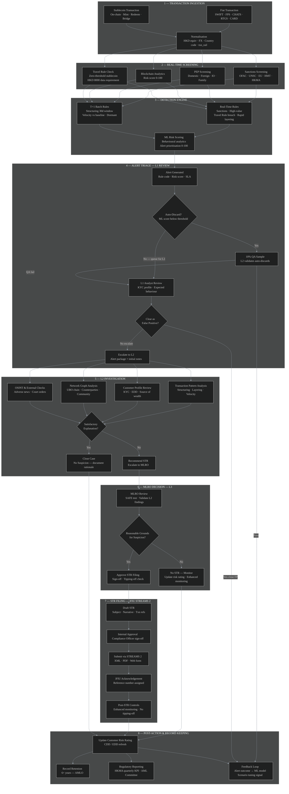
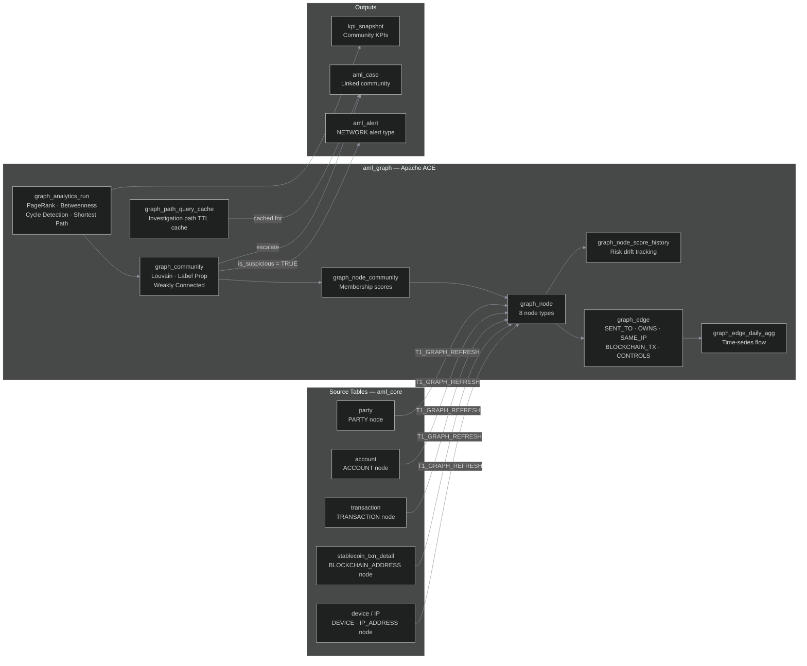

# AML Data Model — Converged Specification
## Fiat & Stablecoin Transaction Monitoring | Network Graph | Behavioural Baselines
> **Regulatory Basis:** AMLO Cap.615 · Stablecoins Ordinance Cap.656 · HKMA AML/CFT Guideline · JFIU STREAMS 2 · FATF Travel Rule (AMLO Sch.2 s.13A)
> **Database:** PostgreSQL 16+ with Apache AGE (openCypher)

---

## Entity Relationship Diagram

```mermaid
%%{init: {
  'theme': 'dark',
  'themeVariables': {
    'primaryColor': '#1e3a5f',
    'primaryTextColor': '#e6edf3',
    'primaryBorderColor': '#388bfd',
    'lineColor': '#8b949e',
    'secondaryColor': '#161b22',
    'tertiaryColor': '#0d1117',
    'attributeBackgroundColorOdd': '#161b22',
    'attributeBackgroundColorEven': '#0d1117',
    'fontFamily': 'ui-monospace, SFMono-Regular, monospace',
    'fontSize': '13px'
  },
  'er': {
    'diagramPadding': 60,
    'layoutDirection': 'TB',
    'minEntityWidth': 200,
    'minEntityHeight': 80,
    'entityPadding': 16,
    'useMaxWidth': true
  }
}}%%
erDiagram

%% ═══════════════════════════════════════════════════════════════
%% SCHEMA: aml_core — KYC · Accounts · Transactions
%% Regulatory: AMLO Cap.615 Sch.2 s.2 (CDD) | s.13A (Travel Rule)
%% ═══════════════════════════════════════════════════════════════

party {
  uuid      party_id                    PK
  varchar   party_type                  "INDIVIDUAL|CORPORATE|FI|TRUST"
  varchar   full_name                   "NOT NULL"
  varchar   hkid_passport_no
  date      date_of_birth
  char2     nationality_code            "ISO 3166-1"
  char2     country_of_residence        "ISO 3166-1"
  varchar   registered_address
  varchar   employer_name
  varchar   occupation_category         "EMPLOYED|SELF_EMPLOYED|RETIRED|STUDENT|OTHER"
  varchar   customer_segment            "RETAIL|SME|CORPORATE|VASP|INSTITUTIONAL"
  varchar   customer_risk_rating        "LOW|MEDIUM|HIGH|PEP|SANCTIONED"
  boolean   is_pep
  boolean   is_sanctioned
  varchar   sanctions_list_ref
  boolean   is_beneficial_owner_identified
  varchar   onboarding_channel          "FACE_TO_FACE|REMOTE|iAM_SMART"
  varchar   source_of_wealth            "EMPLOYMENT|BUSINESS|INHERITANCE|INVESTMENT|OTHER"
  varchar   source_of_funds             "SALARY|BUSINESS_PROCEEDS|LOAN|OTHER"
  decimal   declared_annual_income_hkd
  varchar   expected_txn_profile        "LOW|MEDIUM|HIGH"
  varchar   expected_product_usage      "FIAT_ONLY|STABLECOIN_ONLY|BOTH"
  timestamp cdd_last_reviewed_at
  timestamp edd_required_at
  boolean   is_active
  timestamp created_at
}

party_document {
  uuid      doc_id              PK
  uuid      party_id            FK
  varchar   doc_type            "HKID|PASSPORT|BR|CI|POA"
  varchar   doc_number
  date      expiry_date
  char2     issuing_country
  boolean   is_verified
  timestamp verified_at
}

party_relationship {
  uuid      rel_id              PK
  uuid      party_id_from       FK
  uuid      party_id_to         FK
  varchar   relationship_type   "DIRECTOR|SHAREHOLDER|BENEFICIAL_OWNER|GUARANTOR|TRUSTEE|AUTHORIZED_SIGNATORY"
  decimal   ownership_percentage
  date      effective_from
  date      effective_to
}

beneficial_owner {
  uuid      bo_id               PK
  uuid      party_id            FK "The UBO individual"
  uuid      entity_id           FK "The entity they control"
  decimal   ownership_pct       ">=25% threshold per AMLO"
  varchar   control_type        "DIRECT|INDIRECT|EFFECTIVE"
  varchar   cr_number           "Companies Registry ref"
  date      verified_date
  boolean   is_active
}

pep_record {
  uuid      pep_id              PK
  uuid      party_id            FK
  varchar   pep_category        "DOMESTIC|FOREIGN|IO|FAMILY|CLOSE_ASSOCIATE"
  char3     jurisdiction
  varchar   list_source         "World-Check|Refinitiv|Dow Jones|Manual"
  varchar   status              "CONFIRMED|DISMISSED|UNDER_REVIEW"
  date      identified_date
  date      dismissed_date
  uuid      reviewed_by_user_id FK
}

watchlist_entry {
  uuid      watchlist_id        PK
  varchar   list_type           "OFAC_SDN|UNSC|EU|HMT|HKMA_SANCTIONED|PEP_GLOBAL|PEP_HK|INTERPOL"
  varchar   listed_name         "NOT NULL"
  text      alias_names
  varchar   entity_type         "INDIVIDUAL|ENTITY"
  date      listing_date
  date      delisting_date
  varchar   listing_reason
  boolean   is_active
  timestamp last_synced_at
}

account {
  uuid      account_id          PK
  varchar   account_type        "CURRENT|SAVINGS|FIXED_DEPOSIT|SVF|STABLECOIN_WALLET|CRYPTO_WALLET"
  varchar   account_rail        "FIAT|STABLECOIN"
  varchar   account_number
  char3     currency_code       "HKD|USD|USDT|USDC|HKDG|TCHN"
  varchar   institution_code    "BIC|LEI"
  varchar   account_status      "ACTIVE|DORMANT|FROZEN|CLOSED"
  varchar   account_risk_rating "LOW|MEDIUM|HIGH"
  decimal   current_balance
  varchar   blockchain_address  "On-chain wallet address"
  varchar   blockchain_network  "ETH|TRON|BNB|POLYGON|SOLANA"
  boolean   is_hosted_wallet
  varchar   wallet_custody_type "HOSTED|UNHOSTED|EXCHANGE_CUSTODIED|MULTI_SIG"
  timestamp opened_at
  timestamp created_at
}

account_party_link {
  uuid      link_id             PK
  uuid      account_id          FK
  uuid      party_id            FK
  varchar   role                "OWNER|JOINT_HOLDER|AUTHORISED_SIGNATORY|BENEFICIARY"
  date      effective_from
  date      effective_to
}

transaction {
  uuid      txn_id                  PK
  varchar   txn_reference
  varchar   txn_rail                "FIAT|STABLECOIN — primary discriminator"
  varchar   txn_channel             "SWIFT|CHATS|FPS|JETCO|ACH|RTGS|BLOCKCHAIN|SVF|CARD"
  varchar   txn_type                "CREDIT|DEBIT|TRANSFER|MINT|REDEEM|SWAP|BURN"
  uuid      originator_account_id   FK
  uuid      beneficiary_account_id  FK
  uuid      originator_party_id     FK
  uuid      beneficiary_party_id    FK
  decimal   txn_amount
  char3     txn_currency
  decimal   hkd_equivalent_amount   "NOT NULL — FX-normalised for threshold evaluation"
  varchar   txn_status              "PENDING|COMPLETED|FAILED|HELD|BLOCKED"
  timestamp initiated_at            "Partition key — monthly"
  timestamp settled_at
  char2     originator_country      "ISO 3166-1"
  char2     beneficiary_country     "ISO 3166-1"
  boolean   is_cross_border
  varchar   purpose_code
  varchar   processing_mode         "REALTIME|BATCH"
  boolean   is_aml_processed        "FALSE index for queue querying"
  timestamp ingestion_timestamp
  uuid      batch_run_id            FK
}

wire_transfer_detail {
  uuid      wire_id                     PK
  uuid      txn_id                      FK "UNIQUE — 1:1 with transaction"
  varchar   originator_name
  varchar   originator_account
  varchar   originator_id_no            "HKID or passport"
  varchar   originator_institution_bic
  varchar   beneficiary_name
  varchar   beneficiary_account
  varchar   beneficiary_institution_bic
  varchar   threshold_tier              "BELOW_8K|AT_ABOVE_8K"
  boolean   verified_flag
  varchar   fps_name_match_status       "MATCHED|MISMATCH|BYPASSED"
  varchar   fps_proxy_type              "MOBILE|EMAIL|FPS_ID"
}

stablecoin_txn_detail {
  uuid      sc_txn_id                   PK
  uuid      txn_id                      FK "UNIQUE — 1:1 with transaction"
  varchar   blockchain_tx_hash          "UNIQUE — immutable on-chain ref"
  varchar   smart_contract_address
  varchar   originator_wallet_address
  varchar   beneficiary_wallet_address
  bigint    block_number
  varchar   token_standard              "ERC-20|TRC-20|BEP-20"
  decimal   token_amount
  varchar   token_symbol                "USDT|USDC|HKDG|TCHN"
  boolean   is_unhosted_wallet_involved "Triggers EDD per HKMA"
  decimal   ba_risk_score               "Blockchain analytics 0-100"
  varchar   ba_provider                 "CHAINALYSIS|ELLIPTIC|TRM"
  text      ba_risk_flags               "MIXER|DARKNET|RANSOMWARE|SANCTIONS_DIRECT"
  timestamp on_chain_timestamp
}

travel_rule_record {
  uuid      travel_rule_id              PK
  uuid      txn_id                      FK "UNIQUE — 1:1 with transaction"
  varchar   compliance_status           "COMPLIANT|MISSING_DATA|PENDING|FAILED"
  varchar   originator_name
  varchar   originator_account_ref
  varchar   originator_address
  varchar   originator_cid_number       "Required if >= HKD 8000"
  varchar   beneficiary_name
  varchar   beneficiary_account_ref
  varchar   beneficiary_institution_lei
  boolean   above_hkd8000_threshold     "Zero-threshold; enhanced data above HKD 8k"
  varchar   data_transmission_protocol  "IVMS101|TRISA|OPENVASP|SYGNA"
  timestamp transmitted_at
  text      missing_fields_list
}

%% ═══════════════════════════════════════════════════════════════
%% SCHEMA: aml_detection — Screening · Scenarios · Alerts
%% Regulatory: HKMA AML/CFT Guideline Ch.5 | FATF Rec.15 & 16
%% ═══════════════════════════════════════════════════════════════

screening_result {
  uuid      screening_id            PK
  uuid      txn_id                  FK "nullable"
  uuid      party_id                FK "nullable"
  uuid      account_id              FK "nullable"
  varchar   screen_type             "SANCTIONS|PEP|ADVERSE_MEDIA|BLOCKCHAIN_RISK|HIGH_RISK_COUNTRY|DUAL_USE_GOODS"
  varchar   screen_mode             "REALTIME|BATCH"
  varchar   match_status            "NO_MATCH|POTENTIAL_MATCH|CONFIRMED_MATCH|FALSE_POSITIVE"
  decimal   match_score             "0-100 pg_trgm similarity"
  varchar   matched_watchlist_ref
  varchar   matched_name
  timestamp screened_at
  varchar   review_decision         "CLEARED|ESCALATED|BLOCKED"
  timestamp reviewed_at
}

detection_scenario {
  uuid      scenario_id             PK
  varchar   scenario_code           "e.g. SCN_STRUCT_FIAT_01"
  varchar   scenario_name
  varchar   scenario_category       "STRUCTURING|LAYERING|PLACEMENT|TRAVEL_RULE_BREACH|BLOCKCHAIN_RISK|UNHOSTED_WALLET|VELOCITY|PEP_MONITORING"
  varchar   applicable_rail         "FIAT|STABLECOIN|BOTH"
  varchar   processing_mode         "REALTIME|BATCH|BOTH"
  text      scenario_logic_description
  jsonb     threshold_config        "Parameterised — no schema changes for tuning"
  integer   lookback_window_days
  varchar   severity                "CRITICAL|HIGH|MEDIUM|LOW"
  varchar   status                  "ACTIVE|INACTIVE|TESTING"
  varchar   regulatory_reference    "AMLO|HKMA_GUIDELINE|FATF_REC"
  date      effective_from
}

aml_alert {
  uuid      alert_id                PK
  uuid      scenario_id             FK
  uuid      primary_txn_id          FK
  uuid      primary_party_id        FK
  varchar   alert_type              "TRANSACTION|CUSTOMER|NETWORK|SCREENING|TRAVEL_RULE"
  varchar   alert_mode              "REALTIME|BATCH"
  varchar   alert_status            "OPEN|UNDER_REVIEW|CLOSED_TP|CLOSED_FP|ESCALATED"
  varchar   alert_priority          "CRITICAL|HIGH|MEDIUM|LOW"
  decimal   risk_score              "0-100 ML model prioritisation"
  text      alert_description
  jsonb     triggered_rule_detail   "Snapshot of rule params at firing time"
  decimal   flagged_amount_hkd
  timestamp alert_generated_at
  uuid      assigned_analyst_id     FK
  timestamp sla_due_at
  varchar   disposition             "TRUE_POSITIVE|FALSE_POSITIVE|INCONCLUSIVE"
  timestamp closed_at
}

alert_transaction_link {
  uuid      link_id     PK
  uuid      alert_id    FK
  uuid      txn_id      FK
  varchar   link_reason
}

%% ═══════════════════════════════════════════════════════════════
%% SCHEMA: aml_case_mgmt — Cases · STR · Activity
%% Regulatory: JFIU STREAMS 2 | AMLO 6yr retention | SAFE test
%% ═══════════════════════════════════════════════════════════════

aml_case {
  uuid      case_id                     PK
  varchar   case_reference              "CASE-2026-HK-00001"
  uuid      primary_party_id            FK
  varchar   case_type                   "INVESTIGATION|SAR_PREPARATION|STR_FILED|EDD_REVIEW"
  varchar   case_status                 "OPEN|UNDER_INVESTIGATION|PENDING_STR|STR_FILED|CLOSED"
  varchar   case_priority               "CRITICAL|HIGH|MEDIUM|LOW"
  varchar   ml_typology                 "STRUCTURING|LAYERING|CRYPTO_MIXING|DEFI_LAUNDERING|SANCTIONS_EVASION"
  text      case_summary
  decimal   total_flagged_amount_hkd
  uuid      assigned_analyst_id         FK
  uuid      assigned_supervisor_id      FK
  timestamp opened_at
  timestamp sla_due_at
  boolean   str_filed
  uuid      str_id                      FK
  timestamp created_at
}

case_alert_link {
  uuid      link_id     PK
  uuid      case_id     FK
  uuid      alert_id    FK
  timestamp linked_at
}

case_party_link {
  uuid      link_id             PK
  uuid      case_id             FK
  uuid      party_id            FK
  varchar   party_role_in_case  "SUBJECT|ASSOCIATE|COUNTERPARTY|FACILITATOR"
}

case_activity_log {
  uuid      log_id                  PK
  uuid      case_id                 FK
  uuid      performed_by_user_id    FK
  varchar   activity_type           "CASE_CREATED|ASSIGNED|NOTE_ADDED|ESCALATED|STR_DRAFTED|STR_SUBMITTED|CLOSED|STATUS_CHANGED"
  text      activity_description
  timestamp performed_at
}

str_report {
  uuid      str_id                          PK
  uuid      case_id                         FK
  varchar   str_reference                   "JFIU STREAMS 2 reference"
  varchar   str_status                      "DRAFT|SUBMITTED|ACKNOWLEDGED|SUPPLEMENTAL"
  boolean   is_supplemental
  uuid      original_str_id                 FK "For supplemental STRs"
  varchar   submission_channel              "STREAMS2_WEBFORM|STREAMS2_XML|STREAMS2_PDF"
  varchar   reporting_institution_name
  varchar   reporting_officer_name
  text      subject_details                 "Name HKID DOB address accounts"
  text      suspicious_activity_description
  text      reasons_for_suspicion           "SAFE approach indicators"
  text      applicable_ordinances           "Cap.405|Cap.455|Cap.575"
  decimal   total_amount_reported_hkd
  boolean   tipping_off_risk_assessed
  boolean   no_tipping_off_confirmed        "Mandatory — AMLO prohibition"
  date      activity_period_from
  date      activity_period_to
  timestamp submitted_at
  varchar   jfiu_case_ref
}

str_transaction_link {
  uuid  link_id  PK
  uuid  str_id   FK
  uuid  txn_id   FK
}

%% ═══════════════════════════════════════════════════════════════
%% SCHEMA: aml_graph — Network Graph Layer (Apache AGE)
%% HKMA: Network Analytics for AML/CFT (May 2023)
%% ═══════════════════════════════════════════════════════════════

graph_node {
  uuid      node_id             PK
  varchar   node_type           "PARTY|ACCOUNT|TRANSACTION|IP_ADDRESS|DEVICE|BLOCKCHAIN_ADDRESS|INSTITUTION|LEGAL_ENTITY"
  varchar   node_label
  uuid      source_entity_id    "FK to source table"
  varchar   source_table        "e.g. aml_core.party"
  decimal   risk_score          "0-100 updated by T1_GRAPH_REFRESH"
  jsonb     node_properties     "Flexible attributes"
  boolean   is_flagged
  varchar   flagging_reason
  timestamp last_updated_at
}

graph_node_score_history {
  uuid      history_id          PK
  uuid      node_id             FK
  decimal   previous_score
  decimal   new_score
  decimal   score_delta         "GENERATED STORED column"
  varchar   change_reason
  timestamp changed_at
  uuid      changed_by_job_id   FK
}

graph_edge {
  uuid      edge_id             PK
  uuid      source_node_id      FK
  uuid      target_node_id      FK
  varchar   edge_type           "SENT_TO|RECEIVED_FROM|OWNS_ACCOUNT|CONTROLS|SAME_DEVICE|SAME_IP|BLOCKCHAIN_TX|SAME_ADDRESS"
  decimal   edge_weight         "Amount HKD or frequency"
  integer   txn_count           "Aggregated transaction count"
  decimal   total_amount_hkd
  integer   hop_count
  jsonb     edge_properties
  timestamp event_timestamp
}

graph_edge_daily_agg {
  uuid      agg_id              PK
  date      business_date
  uuid      source_node_id      FK
  uuid      target_node_id      FK
  varchar   edge_type
  integer   txn_count
  decimal   total_amount_hkd
  decimal   max_single_txn_hkd
  varchar   applicable_rail     "FIAT|STABLECOIN"
}

graph_community {
  uuid      community_id            PK
  varchar   community_algorithm     "LOUVAIN|LABEL_PROPAGATION|WEAKLY_CONNECTED"
  date      run_date
  integer   community_size
  decimal   community_risk_score
  decimal   max_node_risk_score
  decimal   total_txn_amount_hkd
  boolean   is_suspicious
  varchar   investigation_status    "UNREVIEWED|UNDER_REVIEW|CLEARED|ESCALATED"
  uuid      linked_case_id          FK
  timestamp detected_at
  timestamp reviewed_at
}

graph_node_community {
  uuid      gnc_id              PK
  uuid      node_id             FK
  uuid      community_id        FK
  decimal   membership_score
}

graph_analytics_run {
  uuid      run_id                      PK
  varchar   algorithm_name              "PAGERANK|BETWEENNESS_CENTRALITY|LOUVAIN_COMMUNITY|CYCLE_DETECTION|SHORTEST_PATH|TRIANGLE_COUNT|WEAKLY_CONNECTED"
  varchar   run_type                    "BATCH|INTERACTIVE"
  date      run_date
  uuid      triggered_by_alert_id       FK "nullable"
  uuid      triggered_by_case_id        FK "nullable"
  integer   nodes_analysed
  integer   edges_analysed
  integer   suspicious_clusters_found
  timestamp started_at
  timestamp completed_at
  varchar   status                      "RUNNING|COMPLETED|FAILED"
}

graph_path_query_cache {
  uuid      query_id            PK
  uuid      case_id             FK
  uuid      alert_id            FK
  uuid      source_node_id      FK
  uuid      target_node_id      FK
  varchar   algorithm           "SHORTEST_PATH|ALL_PATHS"
  text      result_path_nodes   "UUID array"
  text      result_path_edges   "UUID array"
  decimal   result_total_weight
  integer   result_hop_count
  jsonb     result_json
  timestamp queried_at
  timestamp expires_at          "TTL for cache invalidation"
  boolean   is_suspicious
}

%% ═══════════════════════════════════════════════════════════════
%% SCHEMA: aml_behaviour — Customer & Wallet Behaviour Baselines
%% Powers: SCN_VELOCITY_01 | ML alert scoring | Peer segmentation
%% ═══════════════════════════════════════════════════════════════

customer_behaviour_baseline {
  uuid      baseline_id                 PK
  uuid      party_id                    FK
  date      baseline_date               "Updated daily by T1_BEHAVIOUR_REFRESH"
  integer   lookback_days               "90|180|365"
  varchar   applicable_rail             "FIAT|STABLECOIN|BOTH"
  integer   avg_monthly_txn_count
  decimal   avg_monthly_txn_hkd
  decimal   avg_single_txn_hkd
  integer   unique_counterparties_30d
  integer   cross_border_txn_pct
  varchar   most_used_channel           "FPS|SWIFT|BLOCKCHAIN etc."
  char2     primary_jurisdiction        "ISO 3166-1"
  decimal   stddev_txn_amount_hkd       "For velocity threshold calibration"
  decimal   p95_txn_amount_hkd          "95th percentile — HKMA statistical tuning"
  decimal   p99_txn_amount_hkd          "99th percentile"
  varchar   peer_group_id               "For peer segmentation"
  timestamp calculated_at
}

wallet_behaviour_baseline {
  uuid      wallet_baseline_id              PK
  uuid      account_id                      FK "Stablecoin wallet account"
  varchar   blockchain_address              "NOT NULL"
  date      baseline_date
  integer   lookback_days
  integer   avg_monthly_on_chain_txn_count
  decimal   avg_monthly_token_amount_hkd
  integer   unique_wallet_counterparties_30d
  integer   cross_chain_txn_count_30d
  decimal   avg_ba_risk_score_30d
  integer   unhosted_wallet_interactions_30d
  integer   mixer_exposure_count_90d        "Risk flag: exposure to mixers"
  integer   bridge_txn_count_30d            "Cross-chain bridge usage"
  varchar   dominant_token                  "USDT|USDC|HKDG|TCHN"
  varchar   dominant_blockchain             "ETH|TRON|BNB|POLYGON"
  boolean   has_defi_exposure               "DeFi protocol interactions"
  timestamp calculated_at
}

%% ═══════════════════════════════════════════════════════════════
%% SCHEMA: aml_reporting — KPI · Batch · Daily Summary
%% Regulatory: HKMA Thematic Review Apr 2024 (mandatory KPIs)
%% ═══════════════════════════════════════════════════════════════

batch_job {
  uuid      job_id                  PK
  varchar   job_name
  varchar   job_type                "T1_TM_RUN|T1_SCREENING|T1_KPI_CALCULATION|T1_GRAPH_REFRESH|T1_TRAVEL_RULE_CHECK|T1_ALERT_AGING|T1_WATCHLIST_SYNC|T1_BEHAVIOUR_REFRESH"
  varchar   job_status              "PENDING|RUNNING|COMPLETED|FAILED"
  date      batch_date              "T: processing date"
  date      business_date           "T-1: business date"
  timestamp started_at
  timestamp completed_at
  bigint    txn_records_processed
  bigint    alerts_generated
}

kpi_snapshot {
  uuid      kpi_id                          PK
  date      snapshot_date
  varchar   kpi_period                      "DAILY|WEEKLY|MONTHLY|QUARTERLY"
  varchar   applicable_rail                 "FIAT|STABLECOIN|ALL"
  integer   total_active_customers
  bigint    total_transactions_count
  decimal   total_transactions_hkd
  integer   total_alerts_generated
  integer   alerts_realtime
  integer   alerts_batch
  integer   true_positive_alerts
  integer   false_positive_alerts
  decimal   false_positive_rate             "HKMA mandated KPI"
  integer   total_strs_filed
  decimal   str_conversion_rate             "STRs / Productive Cases — HKMA KPI"
  decimal   alert_to_str_rate
  integer   travel_rule_compliant_count
  integer   travel_rule_non_compliant_count
  decimal   travel_rule_compliance_rate
  decimal   alert_rate_per_1000_customers   "HKMA mandated KPI"
  decimal   avg_alert_review_hours
  integer   sla_breach_count
  decimal   sla_breach_rate
  integer   high_risk_blockchain_alerts
  integer   unhosted_wallet_alerts
  timestamp calculated_at
}

kpi_daily_rail_breakdown {
  uuid      breakdown_id                        PK
  date      snapshot_date
  varchar   applicable_rail                     "FIAT|STABLECOIN"
  bigint    txn_count
  decimal   txn_total_hkd
  bigint    txn_cross_border_count
  decimal   txn_cross_border_hkd
  jsonb     txn_by_channel                      "e.g. FPS:1200 SWIFT:340"
  jsonb     txn_by_type                         "e.g. TRANSFER:800 MINT:120"
  integer   alerts_total
  integer   alerts_critical
  integer   alerts_high
  integer   alerts_true_positive
  integer   alerts_false_positive
  integer   travel_rule_total
  integer   travel_rule_compliant
  integer   travel_rule_above_8k
  integer   travel_rule_above_8k_non_compliant
  integer   unhosted_wallet_txns
  integer   blockchain_risk_alerts
  decimal   ba_avg_risk_score
  integer   strs_filed
  timestamp calculated_at
}

kpi_alert_heatmap {
  uuid      heatmap_id          PK
  date      snapshot_date
  integer   alert_hour          "0-23 UTC+8"
  uuid      scenario_id         FK
  varchar   applicable_rail
  integer   alert_count
  integer   true_positive_count
  decimal   total_amount_hkd
  timestamp calculated_at
}

scenario_kpi {
  uuid      scenario_kpi_id         PK
  uuid      scenario_id             FK
  date      snapshot_date
  varchar   kpi_period              "DAILY|WEEKLY|MONTHLY|QUARTERLY"
  integer   alerts_generated
  integer   true_positives
  integer   false_positives
  decimal   false_positive_rate
  integer   strs_from_scenario
  decimal   avg_risk_score
  decimal   min_risk_score
  decimal   max_risk_score
  varchar   tuning_recommendation   "INCREASE_THRESHOLD|DECREASE_THRESHOLD|RETIRE_SCENARIO|NO_CHANGE"
}

regulatory_submission_log {
  uuid      submission_id           PK
  varchar   submission_type         "STR_STREAMS2|HKMA_TM_KPI_QUARTERLY|HKMA_ANNUAL_TUNING|STABLECOIN_QUARTERLY"
  date      reporting_period_from
  date      reporting_period_to
  timestamp submitted_at
  varchar   regulator_ref
  varchar   status                  "PENDING|SUBMITTED|ACKNOWLEDGED|REJECTED"
}

%% ═══════════════════════════════════════════════════════════════
%% SCHEMA: aml_audit — Users · Immutable Audit Trail
%% Regulatory: AMLO 6+ year record retention
%% ═══════════════════════════════════════════════════════════════

aml_user {
  uuid      user_id         PK
  varchar   full_name
  varchar   email
  varchar   role            "ANALYST_L1|ANALYST_L2|SUPERVISOR|MLRO|COMPLIANCE_OFFICER|GRAPH_ANALYST|ADMIN|READONLY"
  boolean   is_active
  timestamp last_login_at
  timestamp created_at
}

audit_log {
  uuid      audit_id            PK
  uuid      user_id             FK
  varchar   schema_name
  varchar   table_name
  uuid      record_id
  varchar   action              "INSERT|UPDATE|DELETE|VIEW|EXPORT"
  jsonb     old_values
  jsonb     new_values
  inet      ip_address
  varchar   user_agent
  timestamp performed_at
  date      retention_expiry    "7 years — immutable"
  boolean   immutable_flag      "TRUE; no DELETE grants"
}

%% ═══════════════════════════════════════════════════════════════
%% RELATIONSHIPS — aml_core
%% ═══════════════════════════════════════════════════════════════

party ||--o{ party_document : "has documents"
party ||--o{ party_relationship : "from party"
party ||--o{ party_relationship : "to party"
party ||--o{ beneficial_owner : "is UBO of entity"
party ||--o| pep_record : "screened as PEP"
party ||--o{ account_party_link : "linked via"
account ||--o{ account_party_link : "linked via"
account ||--o{ transaction : "originates"
account ||--o{ transaction : "receives"
party ||--o{ transaction : "originator"
party ||--o{ transaction : "beneficiary"
transaction ||--o| wire_transfer_detail : "extended by (fiat wire)"
transaction ||--o| stablecoin_txn_detail : "extended by (stablecoin)"
transaction ||--o| travel_rule_record : "has Travel Rule record"
transaction ||--o{ screening_result : "screened"
party ||--o{ screening_result : "screened"
watchlist_entry }o--o{ screening_result : "matched against"

%% ═══════════════════════════════════════════════════════════════
%% RELATIONSHIPS — aml_detection
%% ═══════════════════════════════════════════════════════════════

detection_scenario ||--o{ aml_alert : "triggers"
detection_scenario ||--o{ scenario_kpi : "measured by"
aml_alert ||--o{ alert_transaction_link : "links transactions"
transaction ||--o{ alert_transaction_link : "linked to alert"

%% ═══════════════════════════════════════════════════════════════
%% RELATIONSHIPS — aml_case_mgmt
%% ═══════════════════════════════════════════════════════════════

aml_alert ||--o{ case_alert_link : "grouped in case"
aml_case ||--o{ case_alert_link : "contains alerts"
aml_case ||--o{ case_party_link : "involves parties"
party ||--o{ case_party_link : "subject of case"
aml_case ||--o{ case_activity_log : "activity logged"
aml_case ||--o| str_report : "results in STR"
str_report ||--o| str_report : "has supplemental"
str_report ||--o{ str_transaction_link : "references transactions"
transaction ||--o{ str_transaction_link : "cited in STR"

%% ═══════════════════════════════════════════════════════════════
%% RELATIONSHIPS — aml_graph
%% ═══════════════════════════════════════════════════════════════

graph_node ||--o{ graph_node_score_history : "risk score history"
graph_node ||--o{ graph_edge : "source of edge"
graph_node ||--o{ graph_edge : "target of edge"
graph_edge }o--o{ graph_edge_daily_agg : "daily aggregation"
graph_node ||--o{ graph_node_community : "member of community"
graph_community ||--o{ graph_node_community : "contains nodes"
graph_community }o--o| aml_case : "escalated to case"
graph_analytics_run ||--o{ graph_community : "detects communities"
graph_path_query_cache }o--o| aml_case : "cached for investigation"
graph_path_query_cache }o--o| aml_alert : "cached for alert"

%% ═══════════════════════════════════════════════════════════════
%% RELATIONSHIPS — aml_behaviour
%% ═══════════════════════════════════════════════════════════════

party ||--o{ customer_behaviour_baseline : "behaviour profile"
account ||--o| wallet_behaviour_baseline : "wallet behaviour"

%% ═══════════════════════════════════════════════════════════════
%% RELATIONSHIPS — aml_reporting & aml_audit
%% ═══════════════════════════════════════════════════════════════

batch_job ||--o{ kpi_snapshot : "produces"
batch_job ||--o{ kpi_daily_rail_breakdown : "produces"
batch_job ||--o{ graph_node_score_history : "triggers refresh"
aml_alert ||--o{ kpi_alert_heatmap : "counted in"
detection_scenario ||--o{ kpi_alert_heatmap : "per scenario"
aml_alert ||--|| aml_user : "assigned to analyst"
aml_case ||--|| aml_user : "assigned analyst"
pep_record ||--|| aml_user : "reviewed by"
audit_log ||--|| aml_user : "performed by"
```

---

## Processing Flow Architecture



---

## T+1 Batch Processing Schedule (HKT)

```mermaid
%%{init: {'theme': 'dark', 'themeVariables': {'primaryColor': '#1e3a5f', 'primaryTextColor': '#e6edf3', 'primaryBorderColor': '#388bfd', 'lineColor': '#8b949e'}}}%%
gantt
  title T+1 Batch Window  00:00 – 06:00 HKT
  dateFormat HH:mm
  axisFormat %H:%M

  section Watchlist
    T1_WATCHLIST_SYNC — OFAC / UNSC / EU / HMT refresh :active, 00:00, 30m

  section Screening
    T1_SCREENING — Re-screen parties vs refreshed lists :00:30, 30m

  section Transaction Monitoring
    T1_TM_RUN — Batch detection scenarios on T-1 txns :01:00, 60m

  section Behaviour
    T1_BEHAVIOUR_REFRESH — Customer and wallet baselines :02:00, 60m

  section Travel Rule
    T1_TRAVEL_RULE_CHECK — Stablecoin compliance audit :03:00, 60m

  section Graph
    T1_GRAPH_REFRESH — Materialise nodes + edges + community :04:00, 60m

  section KPI
    T1_KPI_CALCULATION — fn_compute_daily_kpi() :05:00, 55m

  section SLA
    T1_ALERT_AGING — Flag SLA breaches + escalations :06:00, 5m
```



---

## Graph Analytics Layer



---

## Schema Summary — 40 Tables across 7 Schemas

| Schema | Tables | Purpose |
|---|---|---|
| `aml_core` | 11 | KYC, demographics, fiat + stablecoin transactions, Travel Rule |
| `aml_detection` | 4 | Detection engine, screening, alert lifecycle |
| `aml_case_mgmt` | 6 | Investigation workflow, JFIU STREAMS 2 STR |
| `aml_graph` | 8 | Apache AGE graph analytics, score history, path cache |
| `aml_behaviour` | 2 | Customer and wallet behavioural baselines |
| `aml_reporting` | 7 | HKMA KPI dashboard, per-rail breakdown, regulatory submissions |
| `aml_audit` | 2 | Immutable audit trail, RBAC users |
