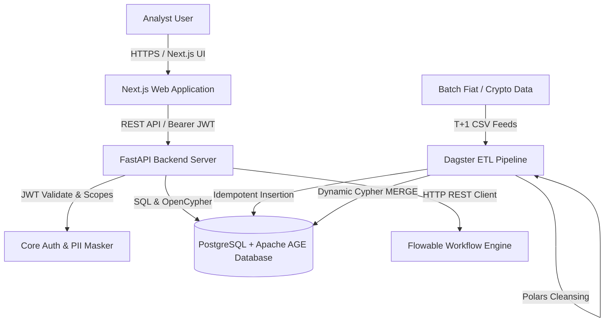
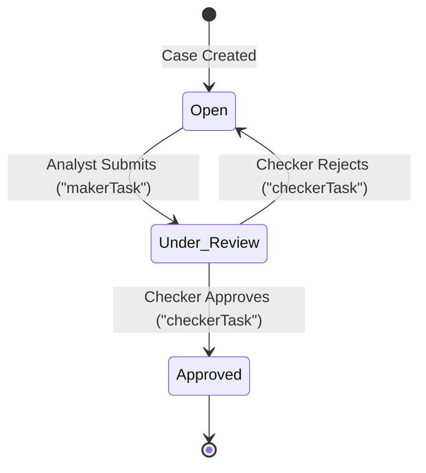

# Overwatch Code Explanation and Architecture Walkthrough

This document provides a comprehensive technical explanation of the **Overwatch AML (Anti-Money Laundering) Platform**, detail-mapping its hybrid relational-graph database architecture, batch data ingestion ETL pipeline, FastAPI backend framework, Role-Based Access Control (RBAC) mechanisms, and the Flowable-orchestrated case management workflow.

---

## 1. High-Level System Architecture

Overwatch utilizes a robust, N-tier distributed architecture specifically engineered to handle, clean, store, and analyze unified fiat (traditional bank transfers) and Web3 (on-chain crypto transactions) financial data streams.

### Component Diagram



### Flow of Execution

1. **Ingestion & Sync**: Daily T+1 batch CSV files containing fiat and crypto transactions are picked up by a **Dagster ETL pipeline**. Polars performs initial validation and structured cleanup, writing clean records into relational SQL tables, and synchronizes the active graph model within **Apache AGE** using dynamic OpenCypher transactions.
2. **API Access**: Analysts interact with a modern **Next.js workspace** which queries the **FastAPI backend**.
3. **Authentication**: All endpoints are secured using role-based JWTs. Roles map directly to hierarchical data views.
4. **PII Protection**: If a junior analyst queries alerts or graph data, personal identifiable information (PII) like names, email addresses, and wallet structures are masked dynamically on the fly.
5. **Investigation Workspace**: If an analyst decides to escalate an alert, the platform triggers a Maker-Checker process instance in the **Flowable Process Engine**, tracking the state of both PostgreSQL status variables and Flowable BPMN states.

---

## 2. Database Topology & Hybrid Relational-Graph Design

The underlying persistence tier leverages PostgreSQL 16+ enhanced with **Apache AGE**, a robust extension that adds graph database capability (supporting OpenCypher query syntax) directly on top of relational table schemas.

### 2.1 Relational Data Modeling

Relational storage is organized into three distinct schemas: `raw` (system dead-letters), `core` (sanitized ingestions), and `public` (roles and accounts):

*   **`core.customers`**: Holds core customer IDs (`customer_num`).
*   **`core.counterparties`**: Identifies transfer counterparties. Includes a flag `is_merchant` to segregate consumer-to-business transactions.
*   **`core.transactions`**: Stores fiat and crypto ledgers.
    *   `txn_hash`: Serves as the primary key. Generated as a cryptographic SHA-256 hash of the record's payload to ensure complete idempotency.
    *   `cdi_code`: Denotes transfer direction (`D` for Debit, `C` for Credit).
*   **`public.users`**: System application users mapping to an enum `user_role` comprising `JUNIOR_ANALYST`, `SENIOR_INVESTIGATOR`, `DEPARTMENT_HEAD`, and `ADMIN`.

### 2.2 Graph Modeling (Apache AGE)

Using Apache AGE's `tap_and_go_network` graph namespace, financial networks are modeled natively:

*   **Vertex Nodes**:
    *   `Customer`: Represents internal clients (attributes: `id`).
    *   `Counterparty`: Represents non-client peer addresses or bank accounts (attributes: `id`).
    *   `Merchant`: Represents business entities (attributes: `id`).
*   **Edge Relationships**:
    *   `TRANSFERRED`: Represents peer-to-peer fiat or crypto transactions (attributes: `txn_hash`, `amount`).
    *   `PAID`: Represents customer-to-merchant debit transactions (attributes: `txn_hash`, `amount`).

---

## 3. Ingestion Pipeline & Graph Synchronization (`etl/daily_pipeline.py`)

The ETL system is structured as a five-stage Dagster workflow executing sequentially:


### 3.1 Data Loading & Cleansing (`load_csv_to_postgres`)
1. **Polars Reading**: Read input CSV files using `polars.read_csv`, ignoring parsing errors and inferring schema up to 10k rows to guarantee fast execution.
2. **Column Normalization**: Normalizes spaces and underscores (e.g., `customer num` to `customer_num`).
3. **Cryptographic Idempotency Hash**:
   Generates a standard transaction hash `txn_hash` mathematically derived from the record itself:
   ```python
   pl.concat_str([
       pl.col("customer_num").cast(str),
       pl.col("txn_date").cast(str),
       pl.col("txn_ref_no").cast(str),
       pl.col("txn_currency_amount").cast(str)
   ]).map_elements(lambda s: hashlib.sha256(s.encode()).hexdigest(), return_dtype=pl.String)
   ```
4. **Garbage Prefix Removal**: Strips standard banking prefix junk like `PAY TO `, `PAY FROM `, and `(FOREIGN TXN FEE) ` to establish clean counterparty identifiers.
5. **Relational UPSERT**: Uses `psycopg2.extras.execute_values` to upsert customers, counterparties, and transactions relational records using `ON CONFLICT DO NOTHING`.

### 3.2 Graph Synchronizer (`update_graph_model`)
Once transactions are stored in standard tables, they are projected into the Apache AGE graph model using a `PL/pgSQL` dynamic loop block:

1. **Entity Synchronization**: Loops over `core.customers` and `core.counterparties`, creating graph vertices using OpenCypher's `MERGE` statement:
   ```sql
   -- Loop for Customers
   FOR c IN SELECT customer_num FROM core.customers LOOP
       EXECUTE format('SELECT * FROM cypher(''tap_and_go_network'', $cypher$ MERGE (n:Customer {id: ''%s''}) $cypher$) AS (a agtype);', c.customer_num);
   END LOOP;
   ```
2. **Transaction Edge Insertion**: Evaluates debit/credit codes (`cdi_code`) and counterpart type (`is_merchant`) to establish edge relationships (`TRANSFERRED` vs. `PAID`):
   ```sql
   -- Loop for transactions to draw edges matching source and destination nodes
   EXECUTE format('SELECT * FROM cypher(''tap_and_go_network'', $cypher$ MATCH (src:Customer {id: ''%s''}), (dst:Merchant {id: ''%s''}) MERGE (src)-[e:PAID {txn_hash: ''%s'', amount: %s}]->(dst) $cypher$) AS (a agtype);', t.customer_num, t.counterparty_id, t.txn_hash, t.txn_amount_in_hkd);
   ```

---

## 4. FastAPI Backend Components & Services

The FastAPI backend handles network visual exploration, authentication, dynamic PII masking, and case management.

### 4.1 Authentication & Role-Based Access Control (`app/core/auth.py`)
Authentication relies on Standard OAuth2 with Bearer JWT tokens. It implements scope checks through FastAPI dependencies:

```python
def get_current_user_with_scope(required_scope: str):
    def scope_checker(user: dict = Depends(get_current_user)):
        if required_scope not in user.get("scopes", []):
            if required_scope not in [user.get("role"), "ANY"]:
                raise HTTPException(status_code=403, detail="Insufficient permissions")
        return user
    return scope_checker
```

*   **Hierarchy levels**: `JUNIOR_ANALYST` < `SENIOR_INVESTIGATOR` < `DEPARTMENT_HEAD` < `ADMIN`.
*   **Scopes**: Junior analysts are granted standard access (`alert.read`), whereas exploring network relationships (`graph.explore`) requires Senior Investigator privileges or above.

### 4.2 PII Protection Engine (`app/services/pii_service.py`)
To comply with global regulatory data privacy requirements (e.g., GDPR, CCPA), the application incorporates dynamic masking:

```python
SENSITIVE_FIELDS = {
    "entity_name", "wallet_address", "email", "phone_number",
    "sender_account", "receiver_account", "sender_wallet", "receiver_wallet"
}
```

*   **Masking Logic**:
    *   For crypto wallet addresses, keeps the prefix and suffix visible (e.g., `0x1a2b...9f8e`) for analyst usability.
    *   For emails, account numbers, names, and phone numbers, it replaces values with `***REDACTED***` or masks them completely.
    *   **Senior Investigators** bypass this masking logic, viewing fully unmasked records. Any instance of unmasking is immutably written to compliance audit logs.

### 4.3 Network Visual Explorer API (`app/api/v1/graph.py`)
Graph APIs allow the Next.js visual graph components to dynamically retrieve topological elements up to **5 levels of depth**:

*   **`get_network`**: Fetches the initial base topological graph.
*   **`explore_graph`**: Uses a multi-hop OpenCypher query returning all paths starting at a target entity:
    ```sql
    MATCH path=(root {id: '{entity_id}'})-[*1..{depth}]-(m)
    UNWIND relationships(path) AS rel
    WITH DISTINCT rel
    RETURN properties(startNode(rel)), id(startNode(rel)), label(startNode(rel)), 
           properties(rel), id(rel), label(rel), 
           properties(endNode(rel)), id(endNode(rel)), label(endNode(rel))
    ```
    This query returns start nodes, edge links, and end nodes uniquely, which is then mapped directly into Cytoscape.js compatible JSON nodes and edges.

---

## 5. Flowable Maker-Checker Case Workflow (`app/api/v1/cases.py`)

Case handling enforces the industry-standard **Maker-Checker (Dual Authorization)** pattern. 

### Case Lifecycle State Machine



1.  **Creation**: When an alert is escalated into a Case (`POST /api/v1/cases/`), a case process instance is spun up asynchronously in the Flowable Process Engine (`flowable_client.start_case_process`).
2.  **Maker Task**: The case initializes in the `open` state, placing a `makerTask` in Flowable. A Junior Analyst performs investigation actions and submits findings, driving the case status to `under_review`.
3.  **Checker Task**: The case advances to `checkerTask` in Flowable. A Senior Investigator or Supervisor reviews the evidence. They can:
    *   **Approve**: Completes the workflow, updating the PostgreSQL case status to `approved` / `closed`.
    *   **Reject**: Sends the task back to `makerTask`, resetting the status to `open` for the analyst to correct.

---

## 6. Code Complexity & Technical Assessment

A statistical complexity evaluation highlights hotspots and patterns present in the codebase.

### 6.1 Code Metrics Breakdown

| Metric | Target | Value | Complexity / Risk Assessment |
| :--- | :--- | :---: | :--- |
| **Ingestion Pipeline** | `etl/daily_pipeline.py` | High | High complexity due to dynamic SQL query formation inside PL/pgSQL database transactions. |
| **Database Sessions** | `app/db/session.py` | Low | Simple setup utilizing an asyncpg pool and setting AGE path properties during session handshakes. |
| **API Endpoints** | `app/api/v1/cases.py` | Medium | Involves coordinated state updates between PostgreSQL and the Flowable REST endpoints. |
| **PII Shielding** | `app/services/pii_service.py` | Low | Simple recursive parsing of dictionary lists using set comparisons. |

### 6.2 Key Programming Concepts Used

*   **Asynchronous Context Managers**: Used in `app/main.py` (`lifespan`) to handle connection pools lifecycle securely.
*   **Recursive Sanitization**: Recursively crawls nested JSON responses to mask sensitive data based on the caller's JWT role.
*   **Dynamic PL/pgSQL Injection**: Generates dynamic cypher transactions to update Apache AGE tables inside database routines.

---

## 7. ⚠️ Critical Pitfalls, Bugs, and Vulnerabilities

A security and performance review identified several structural flaws in the current codebase that require attention:

### 7.1 Crucial Runtime Bug in `app/core/auth.py`
In `app/core/auth.py`, `log_audit_event` throws an `AttributeError` when unmasking logging is triggered:
```python
# Lines 81-83 in app/core/auth.py
async def log_audit_event(user_id: str, action: str, details: str):
    timestamp = datetime.datetime.now().isoformat()
    audit_logger.info(...)
```
*   **Why it fails**: The import statement on line 3 is `from datetime import datetime, timedelta`. Because `datetime` is imported directly as the class, calling `datetime.datetime.now()` will raise `AttributeError: type object 'datetime.datetime' has no attribute 'datetime'`.
*   **Impact**: When a Senior Investigator explores the graph or requests alert details, `log_unmasking_event` is called, which calls `log_audit_event`, causing a **500 Server Error** and crashing the client's request.
*   **Fix**: Correct line 81 to use the imported class directly:
    ```python
    timestamp = datetime.now().isoformat()
    ```

### 7.2 Graph Query SQL Injection Risk in `app/services/graph_service.py`
The method `get_neighborhood` uses manual string formatting to inject the entity identifier:
```python
entity_id_clean = str(entity_id).replace("'", "''")
query = f"""
SELECT * FROM cypher('tap_and_go_network', $$
    MATCH path=(root {{id: '{entity_id_clean}'}})-[*1..{depth_clean}]-(m)
    ...
$$) ...
"""
```
*   **Why it's risky**: Standard single-quote escaping (`.replace("'", "''")`) is insufficient to prevent advanced SQL injection inside PostgreSQL dollar-quoted strings (`$$`).
*   **Impact**: A malicious user could craft an `entity_id` payload to escape the cypher query boundaries and execute arbitrary SQL commands.
*   **Fix**: Leverage parameterized inputs in `asyncpg` or execute cypher with values passed as parameters.

### 7.3 Performance Bottleneck in daily ETL loop (`etl/daily_pipeline.py`)
During the graph update phase, `update_graph_model` executes a PL/pgSQL routine with loops that run individual `cypher()` updates inside a cursor for every record:
```sql
FOR t IN SELECT txn.txn_hash, ... FROM core.transactions txn LOOP
    EXECUTE format('SELECT * FROM cypher(...) ...');
END LOOP;
```
*   **Why it's slow**: Doing transactional updates record-by-record via `EXECUTE format(...)` in a cursor has `O(N)` scaling overhead. As transactions scale, this will take hours to process.
*   **Fix**: Use a single bulk query executing Cypher matches on array-passed parameters, or write a dedicated Python graph loader that performs batch updates.

---

## 8. Interactive Practice Exercises & Cypher Training

Test your understanding of Apache AGE and OpenCypher queries with these exercises:

### Exercise 1: Finding 3-Hop Circular Fund Flows
**Scenario**: Money launderers often cycle funds through multiple accounts to obscure source of origin. Write a query to find loops starting at a specific Customer node.

*   **Solution Cypher**:
    ```cypher
    SELECT * FROM cypher('tap_and_go_network', $$
        MATCH path = (c:Customer {id: 'C10002'})-[:TRANSFERRED*3]->(c)
        RETURN path
    $$) AS (path agtype);
    ```

### Exercise 2: Smurfing / Structuring Detection
**Scenario**: Identify any Counterparty that transfers funds to more than 5 distinct Customers in under-threshold amounts ($< $10,000 equivalent) in a single day.

*   **Solution SQL + Cypher**:
    ```sql
    SELECT * FROM cypher('tap_and_go_network', $$
        MATCH (c:Counterparty)-[t:TRANSFERRED]->(cust:Customer)
        WITH c, count(distinct cust) as recipient_count, sum(t.amount) as total_sent
        WHERE recipient_count > 5 AND total_sent > 10000
        RETURN c.id, recipient_count, total_sent
    $$) AS (counterparty_id agtype, recipients agtype, total_amount agtype);
    ```

---

## 9. Suggested Next Steps for the Platform

1.  **Bug Patching**: Apply the `datetime` import fix in `app/core/auth.py` immediately to prevent API runtime errors.
2.  **Parametrization of Graph Queries**: Refactor `graph_service.py` to pass query targets as parameters inside the cypher query instead of string interpolation to prevent injection vulnerability.
3.  **Batching graph ingestion**: Optimize the Dagster transaction sync phase using multi-row batch queries instead of PL/pgSQL cursor loops.
